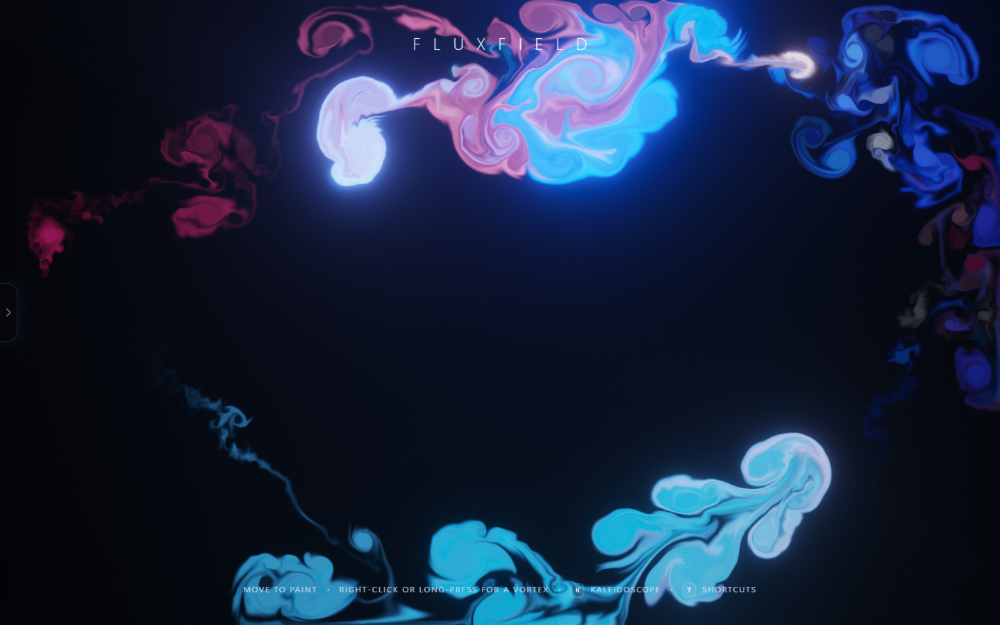
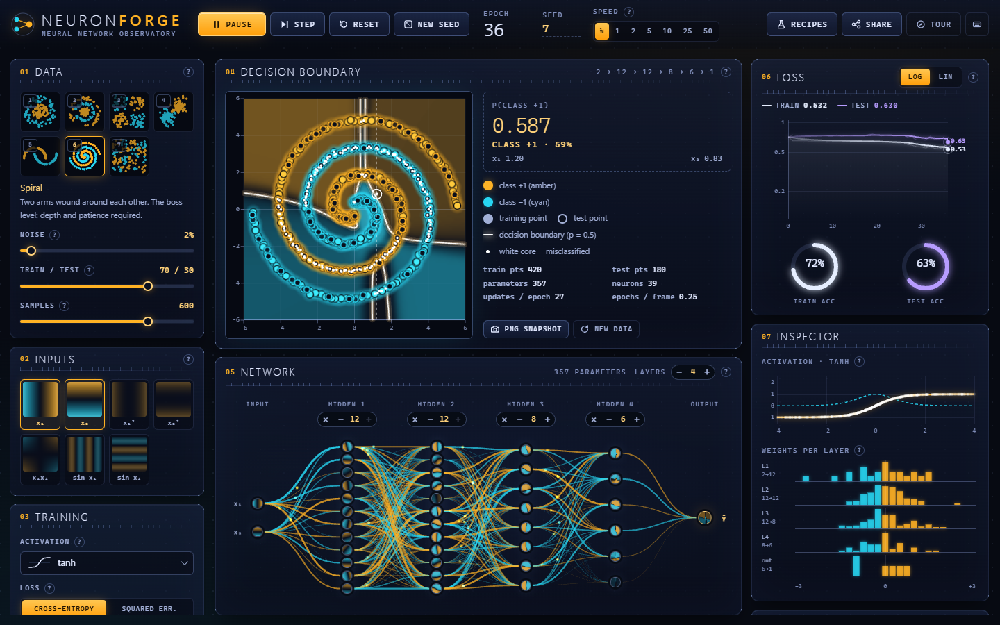
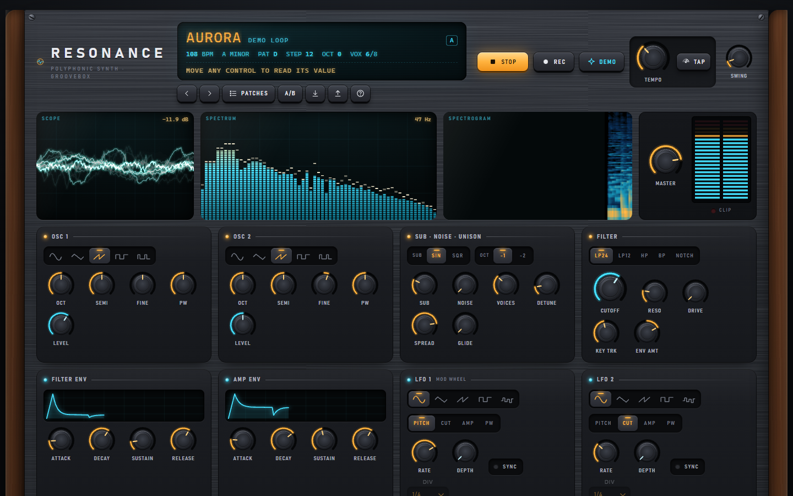
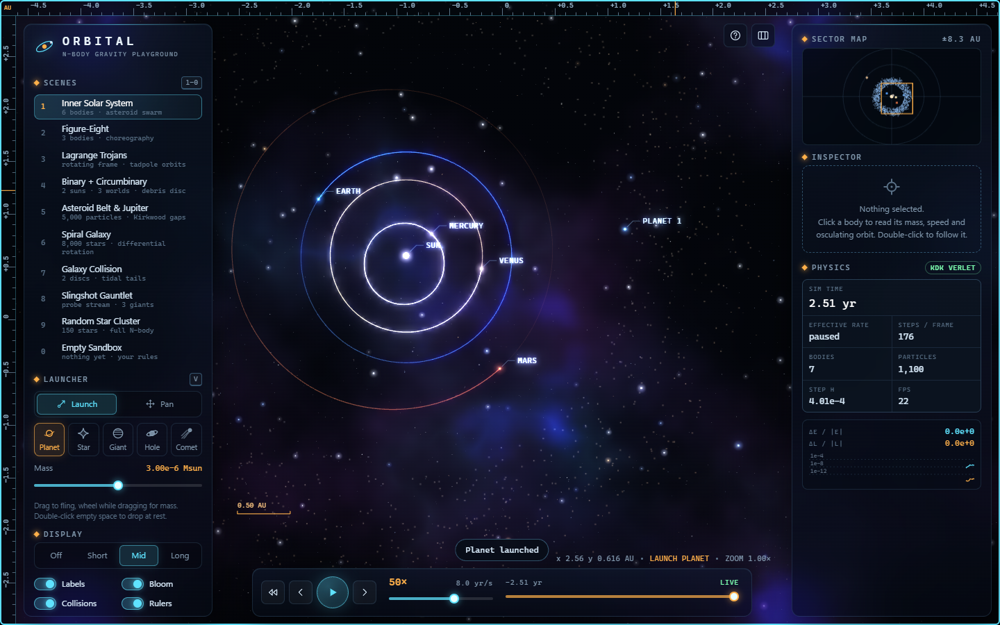
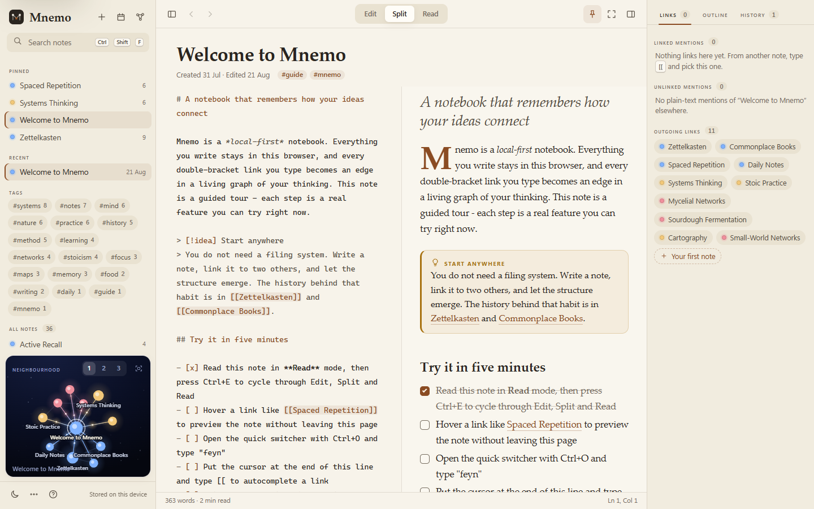
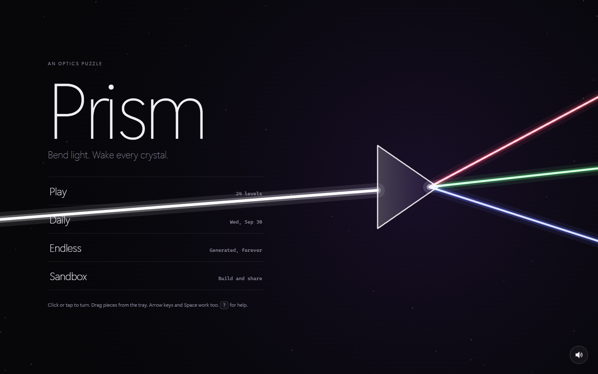
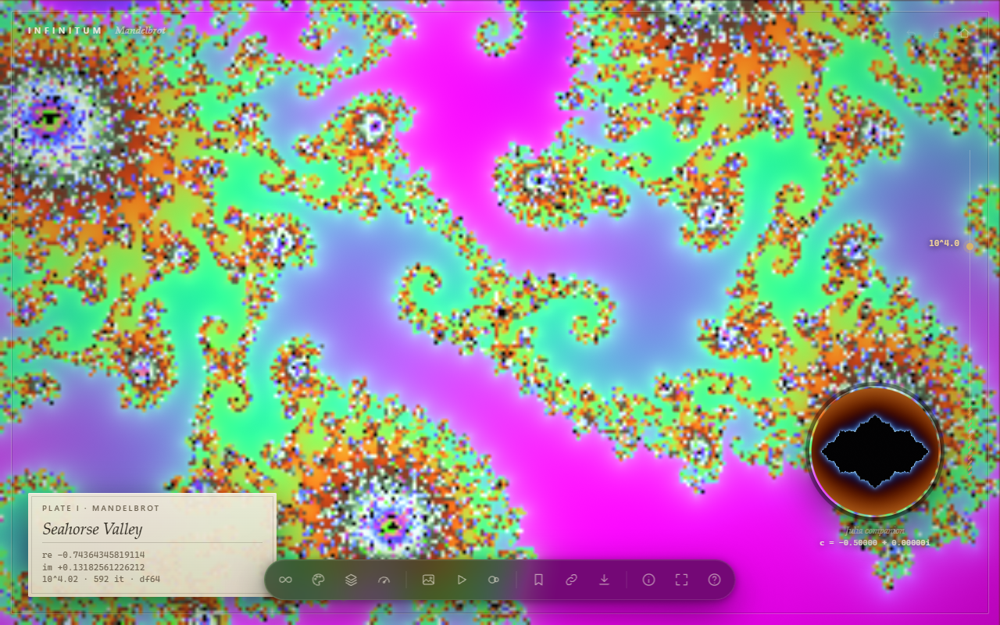
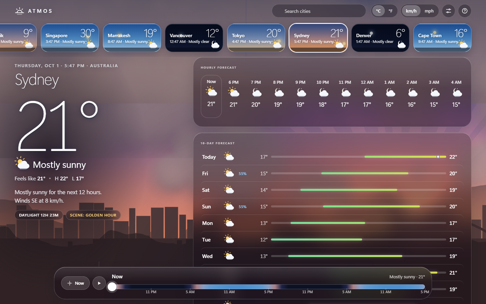
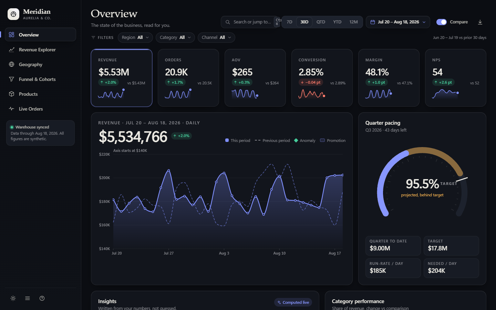

# Claude Code Showcase

### Nine interactive apps. Written by hand. Built in one session. Zero dependencies.

A fluid-dynamics instrument that paints with light. A neural network you can watch think. A synthesizer and drum
machine made of math. A gravity simulator you can rewind. A notebook whose notes grow into a galaxy. A laser puzzle
game. A fractal you can fall into forever. A weather app whose sky is the interface. An analytics cockpit for a
company that does not exist.

Every one of them is plain HTML, CSS and JavaScript. **No frameworks. No libraries. No build step. No network
requests. No logins.** Double-click a file and it runs.

| | |
|---|---|
| **Apps** | 9 |
| **Source files** | 97 (HTML, CSS, JS) |
| **Lines of code** | about 24,000 |
| **Runtime dependencies** | 0 |
| **External network requests** | 0 |
| **Data** | 100% fictional or procedurally generated |

> **Start here:** open [`index.html`](index.html) in this folder. It is a gallery that launches every app.



---

## Table of contents

**For everyone**
1. [Quick start](#1-quick-start)
2. [Meet the apps](#2-meet-the-apps)
   - [Fluxfield](#fluxfield---liquid-light) - GPU fluid and light instrument
   - [Neuron Forge](#neuron-forge---watch-a-network-learn) - a neural network that learns in front of you
   - [Resonance](#resonance---a-studio-made-of-math) - synth, drum machine and sequencer
   - [Orbital](#orbital---gravity-you-can-rewind) - N-body gravity playground
   - [Mnemo](#mnemo---a-notebook-that-grows-a-galaxy) - networked-thought notebook
   - [Prism](#prism---bend-light-wake-every-crystal) - optics puzzle game
   - [Infinitum](#infinitum---a-museum-of-mathematics) - deep-zoom fractal explorer
   - [Atmos](#atmos---weather-you-can-feel) - procedural weather app
   - [Meridian](#meridian---the-executive-cockpit) - commerce analytics dashboard
3. [How much to trust each app](#3-how-much-to-trust-each-app)
4. [Resource index](#4-resource-index) - every folder, file and document

**For engineers**
5. [Technical appendix](#5-technical-appendix)
   - [5.1 Ground rules and why they exist](#51-ground-rules-and-why-they-exist)
   - [5.2 How the work was organised](#52-how-the-work-was-organised)
   - [5.3 The verification harness](#53-the-verification-harness-toolsbrowsemjs)
   - [5.4 Per-app engineering notes](#54-per-app-engineering-notes)
   - [5.5 Numerical and logical results](#55-numerical-and-logical-results)
   - [5.6 Defects found and fixed](#56-defects-found-and-fixed)
   - [5.7 What went wrong in the process](#57-what-went-wrong-in-the-process)
   - [5.8 Known gaps and open items](#58-known-gaps-and-open-items)
   - [5.9 Reproducing the checks](#59-reproducing-the-checks)
   - [5.10 Lessons learned](#510-lessons-learned)
6. [Glossary](#6-glossary)

---

## 1. Quick start

**Easiest:** open [`index.html`](index.html) (the gallery) or any `<app>/index.html` directly. Everything works from
`file://`, fully offline.

**Optional local server** (only needed if you prefer `http://`):

```bash
python -m http.server 8000
# then open http://localhost:8000/
```

**Hosted on Vercel:** the suite is plain static files, so it deploys straight from a GitHub repository with no build
tooling beyond one small Node script. Setup, the `vercel.json` settings, and how to **slot in future apps** are in
[`docs/DEPLOYING.md`](docs/DEPLOYING.md). In short: a new app is a folder with an `index.html` and a small `app.json`; the
gallery picks it up automatically.

**Requirements:** a current Chromium-based browser (Edge or Chrome) is what everything was tested in; the apps were also
reported to run correctly in Firefox by the project owner (not tested by the build sessions). Fluxfield and
Infinitum need WebGL2. Resonance and Prism need a click first, because browsers will not play audio before a user
gesture. Node 22 is needed only to run the unit tests and the test harness.

---

## 2. Meet the apps

Each section has a plain-language pitch, "try this first", and an "under the hood" line for the technical reader.
Each app also has its own detailed `README.md`.

### Fluxfield - liquid light


**The pitch.** Imagine ink dropped into water, lit from within. Fluxfield is a full-screen simulation of real fluid
physics running on your graphics card. Move your mouse and you stir glowing colour into a black void. Leave it alone
and an autopilot "conductor" keeps painting on its own, so it is mesmerising with no input at all. Seven scenes
(Aurora, Ember, Bioluminescence, Nebula Nursery...) change the whole mood in one keypress.

**Try this first.** Load it and just watch. Then press `K` to turn on kaleidoscope symmetry, press `1`-`7` to change
scene, and right-click to plant a persistent whirlpool.

**Under the hood.** A stable-fluids Navier-Stokes solver in WebGL2: curl, vorticity confinement, Jacobi pressure
solve, semi-Lagrangian advection, then a bloom / light-shaft / ACES tone-mapping chain. It adapts its resolution to
your frame rate. About 2,100 lines across 9 files.

[Full README](fluxfield/README.md) | [Launch](fluxfield/index.html)

---

### Neuron Forge - watch a network learn



**The pitch.** Most people have heard that "AI learns from data" but never seen it happen. Neuron Forge lets you
watch. Pick a puzzle (two interleaved spirals is the famous hard one), choose how many neurons to give the network,
press play, and watch the coloured decision boundary reshape itself as the network learns. Every neuron shows a tiny
live picture of what it has figured out. There is a guided tour, five challenges (such as "solve XOR with only three
neurons") and ten one-click experiments that demonstrate classic lessons.

**Try this first.** Press play on the default dataset. Then open **Recipes** and pick *"A single neuron can't do XOR"*,
followed by *"Two hidden neurons can"*.

**Under the hood.** A from-scratch multilayer perceptron with hand-written backpropagation, three optimisers (SGD,
Momentum, Adam), six activations, and two loss functions. The gradient maths was checked against finite differences
for all 12 activation-and-loss combinations (worst relative error 3.6e-6). About 2,800 lines, 14 files, plus a Node
test harness.

[Full README](neuron-forge/README.md) | [Launch](neuron-forge/index.html)

---

### Resonance - a studio made of math



**The pitch.** A complete music workstation in your browser: an eight-voice polyphonic synthesizer, a six-piece drum
machine, a pattern sequencer, an arpeggiator, effects, and live oscilloscope, spectrum and spectrogram displays,
dressed as a piece of boutique hardware with brushed metal and walnut cheeks. There are no audio files in it at all.
Every sound is generated by arithmetic as you play. Press **Power on and play the demo loop** and it starts a track. A **STYLE** button restyles a song into 14 genres, **SONGS** loads 12
public-domain tunes, and **LOOK** re-skins the panel (piano, concert hall, jazz club, tube amp, drum kit, neon).

**Try this first.** Power on with the demo, then press `1`-`4` to switch patterns, play notes on your computer
keyboard (`A W S E D F T G Y H U J K`), and drag the knobs.

**Under the hood.** A Web Audio graph with 8-voice polyphony and voice stealing, band-limited PWM, cascaded-biquad
filters, a convolution reverb whose impulse response is *generated procedurally in code*, a sample-accurate
look-ahead scheduler, and a WAV recorder. About 4,200 lines across 13 files.

> **Honest caveat:** nobody has listened to Resonance yet. It was verified numerically (output levels, no NaN, no
> stuck notes, timing) but not by ear. See [section 3](#3-how-much-to-trust-each-app).

[Full README](resonance/README.md) | [Launch](resonance/index.html)

---

### Orbital - gravity you can rewind



**The pitch.** Fling planets, stars and black holes into a live gravity simulation. Drag to throw a body and watch a
glowing prediction of where it will go before you let go. Load a solar system, a spiral galaxy of 8,000 stars, or two
galaxies colliding and throwing off tidal tails. Then press reverse and watch time run backwards, because the maths
underneath is reversible. A live readout shows how well the simulation conserves energy, so the quality of the
physics is visible, not hidden.

**Try this first.** Press `6` for the Spiral Galaxy, `7` for the Galaxy Collision, or `0` for an empty sandbox and
fling something. Press `R` to reverse time.

**Under the hood.** Velocity-Verlet (a symplectic, time-reversible integrator) with adaptive substepping. Up to 256
massive bodies interact pairwise while up to 24,000 light particles feel only the massive ones, which is what keeps
galaxies at interactive speed. A two-body orbit conserves energy to about 1e-8 over 200 orbits. About 2,900 lines.

[Full README](orbital/README.md) | [Launch](orbital/index.html)

---

### Mnemo - a notebook that grows a galaxy



**The pitch.** A calm, beautiful writing app where every `[[link]]` you type connects two ideas, and the connections
assemble themselves into a glowing map of your thinking. It ships with 36 interlinked notes (about note-taking,
sourdough, Stoicism, mycelial networks and more) so the map is alive from the first second. Everything stays on your
device. There is a distraction-free focus mode, a light and a dark theme, a quick switcher, version history,
backlinks, and a time-lapse that replays how your notebook grew.

**Try this first.** Press `Ctrl+O` and type `feyn`. Then press `Ctrl+G` for the full-screen graph. Press `Ctrl+E` to
cycle Edit / Split / Read.

**Under the hood.** A Markdown engine written from scratch (62 unit tests, including 26 cross-site-scripting
payloads), a textarea-over-highlighted-`pre` editor that keeps native undo, a Barnes-Hut force-directed graph, label-
propagation clustering, and a hand-written ZIP exporter. About 3,500 lines.

[Full README](mnemo/README.md) | [Launch](mnemo/index.html)

---

### Prism - bend light, wake every crystal



**The pitch.** A minimalist puzzle game about light. Rotate mirrors, split beams, mix red, green and blue into yellow,
cyan and white, and send light through portals to wake every crystal. Twenty-four handcrafted levels in four
chapters teach one idea at a time; a daily puzzle and endless mode generate fresh boards; a sandbox lets you build
and share your own with a copy-paste code. Beams glow and bloom against dark glass, or switch to the monochrome "Dark Side look"
for hard white light and a six-band spectrum.

**Try this first.** Click **Play**, open level 1, and click the mirror once. Then try the Daily.

**Under the hood.** A linear, per-colour-channel beam tracer; a light-guided solver that proves every level is
solvable and powers the Hint button; and a reverse-construction puzzle generator. All 24 levels were proven solvable
by the solver. About 1,700 lines.

[Full README](prism/README.md) | [Launch](prism/index.html)

---

### Infinitum - a museum of mathematics



**The pitch.** Fall into the Mandelbrot set. Zoom into the infinitely detailed boundary of one of mathematics' most
famous shapes, rendered live on your GPU, then switch to its relatives (Julia sets, the Burning Ship, Newton
fractals). Fourteen "plates" with wall-label captions take you to the famous spots. Leave it alone and it gives
itself a guided tour. A small circle shows the matching Julia set for wherever your cursor is.

**Try this first.** Let the intro dive finish. Press `T` for the tour, `P` to change palette, `J` to jump into the
Julia set under your cursor.

**Under the hood.** WebGL2 shaders with automatic switch to *double-single* arithmetic (pairs of 32-bit floats
emulating roughly 46 bits of precision) for deep zoom, Brent cycle detection, progressive Halton-jittered
anti-aliasing and tiled 4096-pixel export. About 1,700 lines.

[Full README](infinitum/README.md) | [Launch](infinitum/index.html)

---

### Atmos - weather you can feel



**The pitch.** A weather app where the sky *is* the interface. Behind frosted-glass forecasts, a living sky moves
through dawn, day, golden hour, dusk and night, with drifting clouds, rain, snow, fog and lightning, and a sun and
moon that travel across it. Drag the scrubber along the bottom and the next 48 hours play out: the sky, the
temperature and the forecast all morph together. 18 cities (Texas, California, Washington, Florida, North
Carolina, Japan) now show **real** forecasts, alerts and local news and video; the other 7 are marked DEMO and
are invented. It is a design showcase and not an official warning service.

**Try this first.** Drag the bottom time bar. Press `C` to cycle cities, `D` for the scene panel (force a
thunderstorm or snow), and `Space` for a time-lapse of a full day.

**Under the hood.** Weather is a pure function of (city, hour) built from seeded noise plus a real solar-position and
moon-phase model, which is why scrubbing is smooth. The sky is a 2D canvas with offscreen cloud tiles and the glass
UI adapts its ink colour to the sky's brightness. About 1,100 dense lines.

[Full README](atmos/README.md) | [Launch](atmos/index.html)

---

### Meridian - the executive cockpit



**The pitch.** An analytics product for a fictional premium home-goods company, *Aurelia & Co.* Six views: an
overview with headline numbers and a quarter-pacing gauge, a revenue explorer you can slice and zoom, a US tile-map
of demand by state, a conversion funnel that points out the "biggest leak", a product table with a detail drawer, and
a live feed of orders arriving. Dark and light themes, a command palette, and a mobile layout with a bottom tab bar.

**Try this first.** Press `g` then `f` for the funnel; `g` then `g` for the map; `T` to flip the theme; `Ctrl+K`
for the command palette; click any product to open its drawer.

**Under the hood.** All charts are hand-built SVG. Routing is hash-based (`#/explorer`), data is generated from a
seeded PRNG, and the DOM is built with a tiny hyperscript-style helper. About 3,800 lines across 19 files.

[Full README](meridian/README.md) | [Launch](meridian/index.html)

---

## 3. How much to trust each app

Honesty matters more than polish, so here is what has been checked. "Console clean" means the page was opened in
headless Edge and produced **zero** errors or warnings. It does *not* mean every feature works.

| App | Console clean | Interaction checked by a person or script | Logic tests | Main gaps |
|---|:-:|---|---|---|
| **Prism** | Yes | Title, level select and level 1 solved with a real mouse click | 41 tracer tests, 24/24 levels solver-proven | Levels 2-24 in the UI, drag-and-drop, audio, Daily / Endless / Sandbox, Hint, mobile |
| **Meridian** | Yes | All 6 views, palette, theme, compare toggle, product drawer, mobile | None | Date picker, CSV export, density; KPI reconciliation never checked; two minor visual overlaps |
| **Neuron Forge** | Yes | Scripted: hover, edge scrubber, recipes, shortcuts, a full challenge win | Gradient check passes (12 combos); XOR / circle / spiral reach > 95% | Tour steps 2 and 4-7, file downloads, Firefox / Safari, touch |
| **Mnemo** | Yes | `[[` autocomplete, follow link, backlinks, search, rename-updates-links, graph, quick switcher, mobile | 62 Markdown tests pass | Time-lapse, export / import, daily note, tablet widths |
| **Orbital** | Yes | Solar System, Figure-Eight, Spiral Galaxy, sandbox fling, mobile | Node physics tests pass (see [5.5](#55-numerical-and-logical-results)) | Other scenes visually, reverse / scrub in the UI, touch |
| **Fluxfield** | Yes | Scenes, drags, wells, symmetry, overlays, capture start / stop | None (visual) | Real-GPU frame rate, end-to-end video recording, adaptive step-down |
| **Infinitum** | Yes | Intro, tour, Julia inset, palette change | GPU-vs-CPU numerical self-test | Relief mode, Newton, export, mobile, deeper zoom |
| **Atmos** | Yes | Scrubbing, city switching, scenes, mobile | `Data.selfCheck()` passes | Text contrast on bright skies (never re-measured), tablet / 2560 px |
| **Resonance** | Yes | Splash, power-on, demo (programmatically) | Offline renders of drums and 12 of 13 presets are finite and below 0 dBFS | **Never listened to**; WAV export, patch save / load, arpeggiator, mobile |

Items in the "Main gaps" column are not known to be broken. They are simply unchecked.

---

## 4. Resource index

### Root

| Resource | What it is |
|---|---|
| [`index.html`](index.html) | The gallery. Animated constellation background, filterable cards with screenshot thumbnails, press `1`-`9` to open an app. Reads its app list from `registry.js` |
| [`README.md`](README.md) | This document |
| [`registry.js`](registry.js) | **Generated.** App list, code statistics and site settings read by the gallery (`window.SHOWCASE_REGISTRY`) |
| [`site.config.json`](site.config.json) | Site title and the GitHub repo URL used for README links on the hosted site |
| [`vercel.json`](vercel.json), [`package.json`](package.json) | Vercel build settings and convenience scripts (no dependencies) |
| [`assets/thumbs/`](assets/thumbs/) | **Generated** 960 px WebP gallery thumbnails (about 450 KB total) |
| [`docs/DEPLOYING.md`](docs/DEPLOYING.md) | Push-to-Vercel guide and how to add a new app |
| [`docs/BUILD-STANDARDS.md`](docs/BUILD-STANDARDS.md) | The written brief every app was built against: ground rules, design bar, engineering bar, verification, README structure |
| [`<app>/app.json`](fluxfield/app.json) | Per-app gallery manifest (name, category, pitch, tags, colour, order) |
| [`tools/build-registry.mjs`](tools/build-registry.mjs) | Finds every app, validates manifests, writes `registry.js`. Vercel runs it on each deploy |
| [`tools/make-thumbs.scenario.mjs`](tools/make-thumbs.scenario.mjs) | Makes the gallery thumbnails from each app's hero screenshot (run through the harness) |
| [`tools/serve.mjs`](tools/serve.mjs) | Zero-dependency local static server that mirrors the hosted behaviour and prints LAN addresses for phone testing |
| [`tools/browse.mjs`](tools/browse.mjs) | Zero-dependency headless-Edge driver (Chrome DevTools Protocol): click, type, drag, resize, screenshot, console capture |
| `_scratch/` | Working screenshots and throw-away test scripts from verification. Git-ignored; safe to delete |

### Apps

| App | Launch | README | Screenshots | Tests |
|---|---|---|---|---|
| Fluxfield | [index.html](fluxfield/index.html) | [README](fluxfield/README.md) | [screenshots/](fluxfield/screenshots/) | none (verified visually) |
| Neuron Forge | [index.html](neuron-forge/index.html) | [README](neuron-forge/README.md) | [screenshots/](neuron-forge/screenshots/) | `tests/verify-engine.cjs` |
| Resonance | [index.html](resonance/index.html) | [README](resonance/README.md) | [screenshots/](resonance/screenshots/) | none in folder (harness was kept outside) |
| Orbital | [index.html](orbital/index.html) | [README](orbital/README.md) | [screenshots/](orbital/screenshots/) | `tests/physics.test.mjs` |
| Mnemo | [index.html](mnemo/index.html) | [README](mnemo/README.md) | [screenshots/](mnemo/screenshots/) | `tests/markdown.test.mjs` |
| Prism | [index.html](prism/index.html) | [README](prism/README.md) | [screenshots/](prism/screenshots/) | `tests/test-core.mjs`, `tests/solve-all.mjs` |
| Infinitum | [index.html](infinitum/index.html) | [README](infinitum/README.md) | [screenshots/](infinitum/screenshots/) | `tests/selftest.js` + `tests/verify.mjs` (run on a GPU) |
| Atmos | [index.html](atmos/index.html) | [README](atmos/README.md) | [screenshots/](atmos/screenshots/) | `Data.selfCheck()` in the page |
| Meridian | [index.html](meridian/index.html) | [README](meridian/README.md) | [screenshots/](meridian/screenshots/) | none |

Every app folder follows the same shape: `index.html`, `css/`, `js/`, `screenshots/`, `README.md`.

### Keyboard shortcuts you can use everywhere

| App | Open-with-one-key moves |
|---|---|
| Gallery | `1`-`9` opens the app |
| Fluxfield | `Space` pause, `K` kaleidoscope, `1`-`7` scenes, `?` help |
| Neuron Forge | `Space` play / pause, `S` step, `R` reset, `1`-`7` dataset, `E` simple mode, `?` help |
| Resonance | `Space` play / stop, `1`-`4` patterns, `A W S E D F T G Y H U J K` play notes, `?` help; STYLE / SONGS / LOOK buttons under the LCD |
| Orbital | `Space` pause, `R` reverse, `1`-`0` scenes, `?` help |
| Mnemo | `Ctrl+O` switcher, `Ctrl+G` graph, `Ctrl+E` mode, `?` help |
| Prism | click / tap rotates, `H` hint, `Ctrl+Z` undo, `?` help; "Dark Side look" button on the title and pause menu |
| Infinitum | `T` tour, `P` palette, `J` Julia, `?` help |
| Atmos | `C` city, `D` scenes, `Space` time-lapse, `?` help |
| Meridian | `g` then `o/r/g/f/p/l` navigates, `T` theme, `Ctrl+K` palette, `?` help |

---

## 5. Technical appendix

Everything below is written for engineers. Claims are tied to evidence where it exists, and anything unverified is
labelled as such.

### 5.1 Ground rules and why they exist

These rules came from [`docs/BUILD-STANDARDS.md`](docs/BUILD-STANDARDS.md) and applied to every app.

| Rule | Reason |
|---|---|
| Plain HTML / CSS / JS, no build step, no npm packages | Hand-rolling charts, physics, audio, Markdown and graph layout *is* the showcase. Also makes each app a folder you can copy anywhere |
| Classic `<script src>` tags, never `import` | Chromium blocks ES-module imports from `file://` (CORS). Each file is an IIFE that hangs off one global namespace (`FF`, `NF`, `NFApp`, ...) |
| Zero external requests: no CDN, no web fonts, no remote images | Works offline; nothing leaves the machine. Typography uses system font stacks chosen deliberately (e.g. `"Segoe UI Variable Display"`, `"Cascadia Code"`, an Iowan / Palatino serif stack) |
| All data fictional or generated | No real people, companies, credentials or business data |
| Seeded PRNG everywhere (`mulberry32`) | Reproducible demos, screenshots and tests. Mock data, reverb impulse responses, dataset generation and puzzle generation are all seeded |
| `localStorage` only inside `try/catch` | Storage can be unavailable (private windows, blocked site data) |
| Zero console errors or warnings | Treated as a hard gate and checked by the harness exit code |
| `prefers-reduced-motion`, keyboard operability, visible focus | Accessibility baseline in every app |
| No emoji as UI icons | Each app ships a hand-drawn inline SVG icon set |

### 5.2 How the work was organised

**Orchestration model.** One orchestrating Claude Code session wrote the shared brief and the test harness, then
launched one specialist sub-agent per app, each with its own art direction, feature list and verification
requirements. Agents worked in parallel in separate folders and were forbidden from touching anything outside their
own app. The orchestrator did not write app code; it reviewed output, ran sweeps, played one game through the UI,
fixed one app-level bug directly, corrected outdated claims in READMEs, and wrote the documentation you are reading.

**Timeline (local time, approximate).**

| Time | Event |
|---|---|
| ~17:37 | Session start; environment checks (Node 22, Edge and Chrome present, WebGL2 works headless with SwiftShader) |
| ~17:45 | `tools/browse.mjs` written and smoke-tested; `docs/BUILD-STANDARDS.md` written |
| 17:50 | Wave 1 launched: Fluxfield, Meridian, Neuron Forge, Resonance |
| 17:53 | Orbital and Prism launched |
| 18:00 | Mnemo and Infinitum launched (8 agents running) |
| ~18:15 | Atmos launched (9th app, shorter time box) |
| 18:27 | Wrap-up message sent to all agents (original deadline 18:42) |
| ~18:35 | Deadline extended to 19:00 at the user's request |
| ~19:03 | "Time is up": inventory showed 5 of 9 READMEs; Meridian's agent was stopped |
| after | Verification and documentation pass in a fresh usage cycle |

**Agent effort as reported by the harness** (these are token and tool-call counts, not dollar figures):

| App | Sub-agent tokens | Tool calls | Wall time |
|---|--:|--:|--:|
| Neuron Forge | 329,492 | 100 | ~82 min |
| Atmos | 216,404 | 53 | ~80 min |
| Prism | 250,040 | 50 | ~79 min |
| Resonance | 363,719 | 47 | ~76 min |
| Mnemo | 351,231 | 68 | ~76 min |
| Orbital | 280,223 | 45 | ~71 min |
| Fluxfield | 284,047 | 78 | ~69 min |
| Infinitum | 243,867 | 40 | ~66 min |
| Meridian | not reported (agent was stopped before finishing) | | |

All agents overran the 20-25 minute time box they were given. Mostly this was because nine agents shared one
machine and the headless-browser harness slowed or failed under load.

**Spend.** The account's extra-usage meter read $425.14 of a $500 limit early in the session and $469.66 about 44
minutes later while up to nine agents were running, roughly $1 per minute. The meter then reset to $1.43 when a new
usage cycle began, so there is **no clean total** for the whole project.

**Pacing decisions.** The first wave was four agents; it was scaled to nine because spend was far below the budget.
Agents were told to write READMEs and screenshots *before* polishing, so that a cut-off would still leave a
documented app. That ordering is the only reason eight of nine apps have complete documentation.

### 5.3 The verification harness (`tools/browse.mjs`)

A single-file, zero-dependency driver (about 150 lines) for headless Edge or Chrome over the Chrome DevTools
Protocol, using Node 22's built-in `WebSocket`.

- **Launch.** Spawns the browser with `--headless=new --remote-debugging-port=<random 9300-9799>` and a throw-away
  `--user-data-dir`. GPU flags `--use-angle=swiftshader --enable-unsafe-swiftshader --ignore-gpu-blocklist
  --enable-webgl` give a **software WebGL2** implementation so the GPU apps can render without a GPU.
  `--allow-file-access-from-files` and `--autoplay-policy=no-user-gesture-required` let `file://` pages and Web Audio run.
- **Attach.** Polls `http://127.0.0.1:<port>/json` until a page target appears, then opens its WebSocket.
- **Protocol calls used.** `Page.navigate`, `Page.captureScreenshot`, `Runtime.evaluate` (with `awaitPromise`),
  `Emulation.setDeviceMetricsOverride` (viewport, mobile, DPR), `Emulation.setEmulatedMedia` (dark, reduced motion),
  `Input.dispatchMouseEvent` (move, press, release, wheel), `Input.dispatchKeyEvent` (with modifier bit-masks),
  `Input.insertText`.
- **Console capture.** Subscribes to `Runtime.consoleAPICalled`, `Runtime.exceptionThrown` and `Log.entryAdded`.
  Exit code is non-zero if any `error`, `exception` or `assert` was seen. The summary line
  `console summary: N error(s), M warning(s)` is what this README means by "console clean".
- **Scenario API.** `--script=file.mjs` exports `default async (page) => {...}` with `wait`, `eval`, `click`,
  `clickAt`, `drag`, `move`, `type`, `key("Control+k")`, `scroll`, `resize`, `shot`, `logs`.
- **Real input, not synthetic events.** Clicks and drags go through the browser's input pipeline, so hit-testing,
  focus and pointer capture behave as for a user.

**Known harness limits.**
- Software WebGL is slow (single-digit to ~25 fps), so screenshots of GPU apps are lower resolution than a real GPU
  would produce, and real-GPU frame rates are unmeasured.
- Headless Chromium has no audio device; Web Audio runs but nothing is audible.
- Chromium only. No Firefox or Safari testing was done.

**Harness defects found and fixed during the project.**
1. *Process leak (Windows).* `proc.kill()` killed only the parent Edge process; its children and the debugging port
   survived. Subsequent runs then sometimes attached to a **stale browser from a different app**, which produced
   one cross-contaminated result (257 spurious `glViewport: negative width/height` warnings attributed to the wrong
   app). Cleanup now uses `taskkill /pid <pid> /T /F`.
2. *Attach timeout.* Edge start-up under heavy load exceeded the original 15 s attach window. It is now 60 s.
3. *Bulk cleanup mistakes.* One agent killed 68 browser processes by name pattern, which probably terminated other
   agents' in-flight runs. Later cleanups were restricted to processes whose command line contained the harness's
   own temp-profile prefix (`showcase-browse-`).

The harness fix passed a syntax check and the batch that followed was clean, but it has not been stress-tested.

### 5.4 Per-app engineering notes

#### Fluxfield
- **Pipeline.** GLSL ES 3.00; one oversized triangle generated from `gl_VertexID` (no vertex buffers); half-float
  ping-pong framebuffers. Step order: curl, vorticity confinement (clamped to 6 screen-heights/s), divergence,
  Jacobi pressure (iteration count is a slider), gradient subtraction, semi-Lagrangian advection of velocity and dye.
  If float textures cannot be linearly filtered, advection and display switch to manual bilinear sampling.
- **Post-processing.** Soft-knee threshold, dual-filter bloom, radial light shafts, ACES filmic tone mapping,
  vignette, sRGB encode, triangular dither.
- **Splats.** Pointer strokes are interpolated into sub-splats; symmetry copies and conductor emitters share one
  queue, flushed in at most two full-screen passes per 48 splats.
- **Look vector.** Everything a scene changes (brush, force, vorticity, fades, bloom, rays, exposure, tint, 12
  palette components) lives in one `Float32Array`; a scene change is a single eased lerp between two vectors.
- **Resolution independence.** Velocity is stored in sim texels/s but every public API uses screen-heights/s, and the
  field is rescaled on resize.
- **Stability.** Velocity limit plus NaN/Inf self-healing in the gradient and advect passes, added after an Ember
  scene went fully black in one run. The exact failure was not reproduced after the fix, so this is defensive, not a
  proven root cause.
- **Adaptive quality.** Levels 1.0 / 0.78 / 0.6 / 0.45 / 0.33; drops one level after two consecutive sub-45-FPS
  seconds with a 3 s cooldown. Software renderers start at 0.45 and cap DPR at 1.
- **Conductor.** Lissajous emitters bent by 3D value-noise curl, a beat-driven pulse layer, yields to input within
  a fraction of a second.

#### Neuron Forge
- **Flat parameter buffer.** Weights, gradients and optimiser moments are parallel `Float32Array`s, so the
  optimiser is a single loop and the gradient check just perturbs `net.P[k]`.
- **Output layer follows the loss.** Cross-entropy uses a sigmoid output with the stable softplus form; MSE uses tanh
  with targets +/-1. Both reduce to cheap output deltas (`y - t` and `(y - t)(1 - y^2)`).
- **Time-sliced training.** Each frame runs `speed` epochs but never more than ~11 ms of work. Visual refreshes are
  decoupled: boundary adapts to its measured cost, neuron maps ~11 Hz, charts ~20 Hz.
- **Rendering split.** One canvas paints up to ~800 edges and 500 particles; neurons are DOM discs so hover and
  click come free. Edges are hit-tested against their sampled Bezier curves. The decision boundary is a 120x120
  field, bilinearly upscaled, with marching-squares contour at p = 0.5.
- **Morphing.** Changing the architecture mid-run keeps surviving weights and starts new neurons quiet.
- **Untrusted input.** `NF.sanitizeConfig` whitelists keys and clamps values on every pasted link or imported JSON.
- **Honest finding.** Two-neuron XOR with tanh solved on only 2 of 16 seeds versus 10 of 16 with swish, so the
  challenge and recipe use swish.

#### Resonance
- **Scheduler.** The classic "tale of two clocks": a 25 ms `setTimeout` loop schedules events 140 ms ahead on the
  `AudioContext` clock.
- **Envelopes.** Linear attack then `setTargetAtTime` decay and release; an analytic `envAt()` evaluates the same
  curve so a release can be scheduled at any future time without reading parameters back.
- **PWM.** Built as a saw minus a delayed copy of itself (band-limited), width modulated by an LFO at audio rate.
- **Reverb.** Impulse response generated in code (decaying, progressively darker stereo noise plus early
  reflections), seeded so a given size / decay / damping always sounds identical; regenerated and cross-faded when
  parameters move.
- **Master bus.** Glue compressor with make-up compensation (Chrome adds automatic make-up gain), limiter, and a
  soft clip: linear to 0.9 then a C1-continuous knee saturating at 0.95 (about -0.45 dBFS ceiling).
- **Recorder.** Lossless 16-bit stereo WAV via a `ScriptProcessorNode` tap that exists only while recording
  (deprecated API, chosen for universal support).
- **Parameter registry.** One entry per control (range, curve, units, formatter) is the single source of truth for
  knobs, presets and automation. The engine runs on any `BaseAudioContext`, which is how offline test renders were done.

#### Orbital
- **Integrator.** Kick-drift-kick velocity Verlet with Plummer softening: symplectic and time-symmetric, hence
  genuinely reversible. Chunked adaptive substepping: step = `eta` x shortest pairwise dynamical time, re-chosen
  every 8 steps.
- **Smart split.** Struct-of-arrays typed arrays. Up to 256 massive bodies interact pairwise (O(N^2)); up to 24,000
  test particles feel only the massive bodies (O(P*M)). **Barnes-Hut was deliberately not used**, so galaxies have
  no self-gravity (restricted-body style).
- **Time control.** True negative-step reverse plus a snapshot history (about 40 MB budget, roughly 10-20 s at 8k
  particles). Restoring a snapshot while rewinding also un-merges collisions.
- **Rendering.** Test particles are splatted bilinearly into a half-resolution additive `ImageData` buffer coloured
  through a 64-entry speed LUT, upscaled with `lighter` compositing. Bloom is a four-level downsample chain.
- **Predicted path.** A forward-integrated copy of the system including the new body's own pull; red X on predicted
  impact.
- **Honest limitation.** Kirkwood gaps are accelerated by boosting Jupiter 5x because the real timescale is far too
  long for a demo.

#### Mnemo
- **Markdown engine.** All text passes through one `esc()`. URLs are allow-listed (`http`, `https`, `mailto`,
  relative) after stripping control and zero-width characters; images must be `data:image/...`. Inline tokens are
  stashed behind placeholders so code spans and wikilinks inside code are never re-interpreted. Link open / close tags
  are stashed separately so `[**bold** link](url)` keeps its emphasis.
- **Editor.** A plain `<textarea>` over a syntax-highlighted `<pre>` with identical metrics, so native undo,
  selection and IME keep working. The `<pre>` defines the height and one wrapper scrolls, which avoids scroll-sync
  drift. Programmatic edits use `execCommand('insertText')` to preserve undo.
- **Graph.** Barnes-Hut quadtree in typed arrays, link springs, gravity, damping, d3-force-style alpha cooling that
  re-heats on drag. Clusters by label propagation (best of 14 seeded runs by modularity). Labels use greedy
  rectangle culling ordered by importance.
- **Store.** Link / tag index, ranked search, rename that rewrites links, versions captured after a two-minute pause
  or on `Ctrl+S`, and a hand-rolled ZIP writer (stored entries, CRC-32, UTF-8 flag).
- **Seed notebook.** 36 notes, 172 links, 3 unresolved on purpose, validated by script.

#### Prism
- **Tracer.** Optics is linear per colour channel, so red, green and blue propagate independently as intensities over
  a field of (cell, direction) states: mirrors reflect, splitters halve, prisms send R left / G straight / B right
  (only through the flat face), filters apply a channel mask, portals teleport. Additive mixing falls out because
  intensities accumulate. Guards: recursion-stack cycle guard, intensity floor (0.03), depth limit, operation cap. A
  crystal is lit when the primaries above 0.2 power exactly equal its colour.
- **Levels authored solved, then scrambled.** `buildLevel()` scrambles the rotatable pieces and lifts "loose" pieces
  into the tray, so every level is solvable by construction; the solver then re-proves it independently.
- **Solver.** Light-guided: only pieces and cells that light currently touches can matter. Phase 1 is a bounded BFS
  over single actions (move-optimal); phase 2 is a "locked" DFS that decides each lit piece once in the order light
  reaches it. The Hint button calls the same solver.
- **Generator.** Grows beams outward from emitters, ends each branch in a matching crystal, verifies with the tracer,
  then pulls mirrors into the tray and knocks the rest out of position. Seeds come from `mulberry32(hash32(...))`.
- **Rendering.** Beams merged into straight runs, three additive passes plus a travelling pulse; light layer
  downscaled to a quarter size and re-added for bloom.

#### Infinitum
- **Pipeline.** Iterate into an `RGBA32F` data texture, shade into an `RGBA16F` accumulator, display with cross-fade;
  palette and lighting edits re-shade cached iteration data without re-iterating.
- **Precision.** Float32 until scale 6e-3, then double-single (hi + lo float pairs, error-free transforms hidden
  behind uniform `1.0` barriers so the compiler cannot optimise them away). About 46 usable bits, giving a floor of
  roughly 1e-11 to 1e-12. Below that the zoom is held and a warning shows rather than rendering noise. Newton stays
  float32 (limit ~1e-5). **Perturbation theory was not attempted.**
- **Cycle detection.** Brent periodicity detection with sub-pixel tolerance. A false-positive bug (orbits shadowing
  repelling cycles classed as interior) was found by the GPU-vs-CPU test and fixed.
- **Progressive AA.** One sample while moving at adaptive resolution; Halton-jittered samples accumulate when idle.
- **Newton.** A live-typed real polynomial (degree 2-8), parsed and solved with a Durand-Kerner root finder.
- **Export.** Tiled rendering (384 px tiles) up to 4096 px.

#### Atmos
- **Weather as a pure function** of `(city, absolute local hour)` built from 1-D value noise (precipitation
  potential, cloud, wind, storm, fog) over a seasonal and diurnal temperature model. Continuity is what makes
  scrubbing smooth.
- **Astronomy.** Solar declination and latitude give altitude, sunrise and sunset; a synodic-month model gives moon
  phase.
- **Renderer.** Every parameter eases exponentially toward its target each frame, so city switches, scenes and
  scrubbing all morph rather than cut. Sun and moon are smoothed in screen space because the angle wraps while
  hidden. Clouds are noise-puff tiles tinted by sun colour with `source-atop`, rendered at half resolution.
- **Adaptive ink.** The sky's mid-colour luminance selects white ink on dark glass or deep-blue ink on pale glass,
  with hysteresis.
- **Live data (later round).** `js/live.js` turns Open-Meteo hourly data into the same weather object the synthetic
  function returns, so the sky, scrubber and charts work unchanged; alerts come from NWS, JMA and USGS; news and
  video come from `api/feeds.js`, a serverless function with a fixed source allowlist. See the Atmos README.
- **Self-check.** `Data.selfCheck()` verifies, over 80 city-days, that hourly extremes equal daily hi / lo and that
  sunrise precedes sunset.

#### Meridian
- **Structure.** 19 source files: tokens / shell / view CSS; `data.js` (seeded synthetic data), `analytics.js`
  (aggregation, comparison periods, KPI maths, insight text), `charts.js` (hand-built SVG primitives), `state.js`
  (filters, range, theme, hash sync), `ui.js`, `icons.js`, `util.js`, and one file per view.
- **DOM helper.** `U.h(selector, props, ...kids)` builds elements hyperscript-style and skips `null` children.
- **Routing.** Hash routes such as `#/explorer`; `g` followed by a letter navigates.
- **Funnel.** Bar widths use a square-root scale so late stages stay visible (percentages are exact).
- **Caveat.** This app's build agent was stopped early. The README and verification here were produced afterwards
  by the orchestrating session from the source layout and scripted browser runs.

### 5.5 Numerical and logical results

These are results reported by the build agents from tests they ran in Node or in the browser. The orchestrating
session did **not** re-run them, except where marked.

| App | Test | Result |
|---|---|---|
| Neuron Forge | Backprop vs centred finite differences (eps 1e-6, float64, L1+L2 on) over 6 activations x 2 losses = 12 combos | All pass; worst relative error 3.6e-6, typically 1e-8 to 2e-7 |
| Neuron Forge | Headless training, test accuracy | XOR 98.9% (36 epochs); circle 100%; moons 98.9%; spiral raw x1/x2 only with [12,12,8,6] 100% in 76 epochs; checkerboard (sine features) 92.2% after 1500 epochs |
| Neuron Forge | Reproducibility | Same seed gives bit-identical weights after 40 epochs |
| Orbital | Two-body circular orbit, 200 orbits | max dE/E 1.25e-8, max dL/L 1.8e-14 |
| Orbital | Eccentric orbit e = 0.9 | adaptive: dE/E 1.7e-3 (honestly not great) vs fixed step 9.3e-3 with 4.6x more steps |
| Orbital | Figure-eight, 20 periods | return error 7.9e-3, dE/E 7.3e-5 |
| Orbital | Time reversal, 4,000 steps forward and back, 1,100 particles | bodies return within 6e-13 AU |
| Orbital | Merge | momentum conserved to 1e-16 |
| Orbital | Browser (orchestrator-run) | Spiral Galaxy 7,979 particles, dE/E about 2e-7, 24 fps under software rendering; Figure-Eight loads and runs |
| Mnemo | Markdown engine unit tests | 62 pass, 0 fail, including 26 XSS payloads and a 129 KB document in ~130-170 ms |
| Prism | Tracer unit tests | 41 assertions pass |
| Prism | Solver over the 24 authored levels | 24 of 24 proven solvable from the scrambled start |
| Prism | Solver over 200 generated daily seeds | **147 solved, 53 timed out at 4 s.** All 200 are solvable by construction, so this measures solver speed, and means Hint may be slow or fail on harder Daily boards |
| Infinitum | GPU vs CPU double reference | Mandelbrot mean error 8e-7; Multibrot power 3 in df64 at 1e-7 matches to 8e-8 over 256 samples; no NaN/Inf in 98,304 values |
| Infinitum | Precision at scale 1e-10, 256-px row | float32 gives 1 distinct value (solid blocks); df64 gives 219 |
| Resonance | Live AudioContext, demo running (headless) | master about -13 dB RMS / -8 dB peak; swing step spacing 0.1458 / 0.1319 s around 0.1389 s at 108 BPM |
| Resonance | Offline renders | 6 drum voices non-silent and below 0 dBFS; 12 of 13 presets finite, peaks -5.9 to -8 dBFS, no stuck voices. *Sub Pressure* did not finish rendering |
| Atmos | `Data.selfCheck()` | 80 city-days pass |

### 5.6 Defects found and fixed

| App | Defect | Cause | Fix |
|---|---|---|---|
| Meridian | Literal text "null" printed in the Funnel view (and in the Overview chart legend with Compare off) | `null` passed straight to DOM `append()`, which stringifies it | Pass an empty string. Re-test found no "null" text. *Found by the orchestrator from a screenshot* |
| Fluxfield | Vortex wells drew at the top-left corner | CSS entrance animation owned `transform`, overriding inline position | Position with the independent `translate` property |
| Fluxfield | Ember scene went fully black once | Suspected blow-up (high vorticity at low FPS) | Velocity limit and NaN/Inf self-healing; root cause unproven |
| Fluxfield | Phone view washed out to near-white | Same splat radius covers far more of a narrow canvas | Dye per splat scaled by canvas aspect ratio |
| Neuron Forge | Gradient check "failed" with errors near 1.0 | Activations were `Float32Array` | Test uses float64 buffers; maths was fine |
| Neuron Forge | Hover card and scrubber clipped | Fixed positioning | Self-measure and clamp |
| Neuron Forge | Panels overlapped at 1024 px | Height-locked shell grid | Tablet breakpoint lets the page scroll |
| Resonance | Offline test renders hung | All notes scheduled at once confused voice stealing | Advance the sequencer in 50 ms slices |
| Resonance | Hats ~14 dB below the kick | Gain too low | Raised |
| Orbital | Merge debris absorbed instantly | Spawned inside the merged body | Spawn outside the new radius (found by the merge unit test) |
| Mnemo | App laid out at content height, not viewport | CSS grid with no explicit row track | `grid-template-rows: minmax(0, 1fr)` |
| Mnemo | Empty time-lapse pill visible | `display: grid` beat the `hidden` attribute | Explicit `[hidden]` rules |
| Mnemo | Parsing broke in Node | The file-writing tool turned `\uXXXX` escapes in a regex into raw control characters | Build the character class at runtime from code points |
| Prism | Level 6 had a shortcut; level 12 solved on load; level 21 par too generous | Authoring flaws | Solver caught them: wall added, level redesigned, par set to 4 |
| Prism | Solver solved only ~130 of 200 daily seeds | Search-space explosion | "Locked" causal-order DFS (now 147 of 200) |
| Infinitum | Wrong interior colouring | Periodicity false positive | Found by GPU-vs-CPU test, fixed |
| Atmos | Scene override zeroed storms; flat 18-degree rain temperatures; muddy golden hour | Logic and palette issues | Scoped override, removed clamp, warmed palette |

### 5.7 What went wrong in the process

Stated plainly, because the useful lessons are in the failures.

1. **Over-parallelism starved the verification harness.** Nine agents each spawning headless browsers on one
   machine caused hundreds of Edge processes, intermittent "Could not attach to browser" failures, and shell
   commands that themselves took over a minute. The Prism agent could not run its UI even once; the Orbital agent
   lost its last ~15 minutes; Atmos, Mnemo and Neuron Forge all reported retries.
2. **A bulk cleanup made it worse.** One agent killed 68 browser processes, probably including other agents'
   runs, and then flagged it in its report.
3. **Time boxes were ignored in practice.** Every agent overran 20-25 minutes. The extended deadline helped but
   cost more than planned.
4. **One agent was cut off.** Meridian was stopped before it wrote its README or took screenshots. Its code turned
   out to be complete and good.
5. **Agent self-reports drifted from reality in both directions.** Prism's agent said its UI was "likely buggy"
   and unrun; when the orchestrator ran it, the title screen, level select and level 1 worked first time.
   Orbital's agent reported Figure-Eight as possibly broken; it ran fine. Conversely the agents' reports were
   accurate about gaps in their own verification. Trust the evidence, not the adjectives.
6. **A harness bug briefly produced a false finding.** The cross-contaminated `glViewport` warnings looked like
   an Infinitum bug until the cause was traced to leaked browser processes.
7. **Some checks were abandoned for cost.** Several apps got about two visual review rounds, not the three the
   standards require.

### 5.8 Known gaps and open items

**Never verified by anyone:** Resonance by ear; Firefox and Safari for every app; real touch devices; screen
readers; real-GPU frame rates for Fluxfield, Infinitum and Orbital; `prefers-reduced-motion` behaviour visually;
file downloads (PNG, JSON, WAV, WebM, CSV, ZIP) end to end.

**Known visual issues, unfixed:**
- Meridian Live Orders: the "+$608" badge overlaps the "Orders per minute" label; the filter row slides under the
  sticky header on scroll.
- Atmos: the first city card sits flush against the left edge; scrubber tick labels can collide with the thumb;
  small hero text on bright skies measured 2.2-3.9:1 contrast before a scrim was strengthened and was **not
  re-measured**.
- Orbital: planet labels overlap in the dense inner Solar System at default zoom.

**Known functional limits:**
- Prism Hint can take several seconds or fail on harder generated Daily boards.
- Infinitum cannot zoom past roughly 1e-11 to 1e-12.
- Orbital galaxies have no self-gravity; collisions are inelastic merges only.
- Neuron Forge is single-output binary classification only and trains on the main thread.
- Resonance has one melodic track and uses the deprecated `ScriptProcessorNode` for recording.
- Mnemo keeps notes in the browser unless folder sync is on (Chrome / Edge only); `localStorage` caps notes at roughly 5 MB.

**Documentation caveat.** Three READMEs (Orbital, Prism, Infinitum) contain original agent text that is partly
superseded; each now opens with or contains an update note saying so. Meridian's README was written afterwards.

### 5.9 Reproducing the checks

Run from the repository root. Node 22 is required; nothing needs installing.

```bash
# Unit and numerical tests (agent-written; not re-run by the orchestrator)
node neuron-forge/tests/verify-engine.cjs
node orbital/tests/physics.test.mjs
node mnemo/tests/markdown.test.mjs
node prism/tests/test-core.mjs
node prism/tests/solve-all.mjs --skip-daily      # the 24 authored levels
node prism/tests/solve-all.mjs                   # also the generated daily seeds (slow)

# Screenshot + console-error check for any app (Windows paths resolved automatically)
node tools/browse.mjs fluxfield/index.html --out=_scratch/ff.png --w=1440 --h=900 --wait=4000
node tools/browse.mjs atmos/index.html --out=_scratch/atmos-mobile.png --mobile --wait=3000

# Scripted interaction: write a scenario module and pass it with --script
#   export default async (page) => { await page.key('g'); await page.key('f'); await page.shot('funnel.png'); }
node tools/browse.mjs meridian/index.html --out=_scratch/m.png --script=_scratch/scenario.mjs

# Rebuild the gallery's app list and line counts (also what Vercel runs on deploy)
node tools/build-registry.mjs

# Regenerate gallery thumbnails after changing a hero screenshot, then rebuild the registry
npm run thumbs && npm run registry

# Serve the suite like a static host (and from your phone, via the printed LAN address)
node tools/serve.mjs 8080
```

Flags for `browse.mjs`: `--w --h --wait --scale --mobile --dark --light --reduced --script --out`. The exit code is
non-zero when the page logged a console error.

### 5.10 Lessons learned

- **Write the test harness first, and test the harness.** It was the single most valuable artefact and also the
  single biggest source of lost time once it leaked processes. Process-tree cleanup should have been in version one.
- **Cap concurrency to what the machine can verify, not what the budget allows.** Budget was never the limiting
  factor; shared CPU for headless browsers was.
- **Order the work so a cut-off still leaves something shippable.** "README and screenshots before polish" is why
  the outcome is nine documented apps and not five.
- **Prove the logic in Node before building the UI.** Prism, Orbital, Neuron Forge and Mnemo all built and tested
  their cores headlessly first, which found real bugs cheaply (level shortcuts, merge-debris absorption, the
  float32 gradient-check artefact, Markdown XSS cases).
- **Author puzzles solved, then scramble.** It makes solvability true by construction, and the independent solver
  becomes a design-review tool that caught three level flaws.
- **Make reproducibility a default.** Seeded PRNGs made every screenshot, test and demo repeatable.
- **Read the screenshots like a reviewer, not like an author.** Both the Fluxfield wells bug and the Meridian
  "null" bug were visible in an image long before they were obvious in code.
- **Distrust confident prose.** Verification statements in this repository are only as good as the command that
  produced them; the status tables above separate what was run from what was claimed.

---

## 6. Glossary

| Term | Plain meaning |
|---|---|
| **WebGL2 / shader** | Browser access to the graphics card. A *shader* is a small program that runs for every pixel at once |
| **Navier-Stokes** | The equations that describe how fluids move; Fluxfield solves a simplified version every frame |
| **Backpropagation** | The method a neural network uses to work out which of its internal numbers to nudge to reduce its error |
| **Adam / SGD / Momentum** | Rules for how big and in which direction to nudge those numbers |
| **Gradient check** | A test that compares the maths for "which way to nudge" against a slow brute-force estimate; if they agree, the maths is right |
| **Symplectic / Verlet integrator** | A way of stepping a physics simulation forward that conserves energy over long runs and can be run backwards |
| **Barnes-Hut** | A trick that groups far-away objects together so a gravity or graph layout calculation is much faster |
| **PWM** | Pulse-width modulation; a synthesizer waveform whose shape can be swept for a richer sound |
| **Convolution reverb** | Reverb made by blending a sound with a recording (here, a generated imitation) of a room's echo |
| **dBFS** | Decibels relative to the loudest level digital audio can hold; 0 dBFS is the ceiling, so negative numbers are safe |
| **Double-single (df64)** | Using two ordinary decimal-limited numbers together to get roughly double the precision, needed for very deep zooms |
| **Perturbation theory (fractals)** | A technique for zooming far deeper than float precision allows; *not* implemented here |
| **Wikilink** | A `[[link]]` typed inside a note that points to another note |
| **Label propagation** | A simple algorithm that finds clusters in a network by letting neighbours vote on each other's group |
| **XSS** | Cross-site scripting; an attack where malicious text tricks a page into running code |
| **Seeded PRNG** | A random number generator started from a fixed number so it produces the same "random" results every time |
| **Console clean** | The browser's developer console showed zero errors or warnings during a test |
| **SwiftShader** | A software implementation of the graphics card, used so GPU code can run in tests without a GPU |
| **CDP** | Chrome DevTools Protocol, the interface the test harness uses to drive a browser |
# Claude-Code-Showcase
# Claude-Code-Showcase
