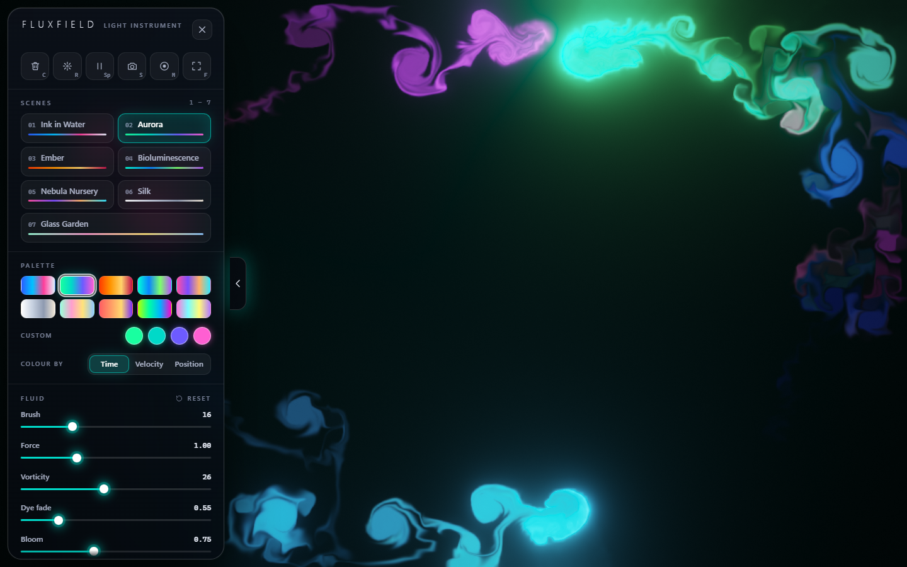
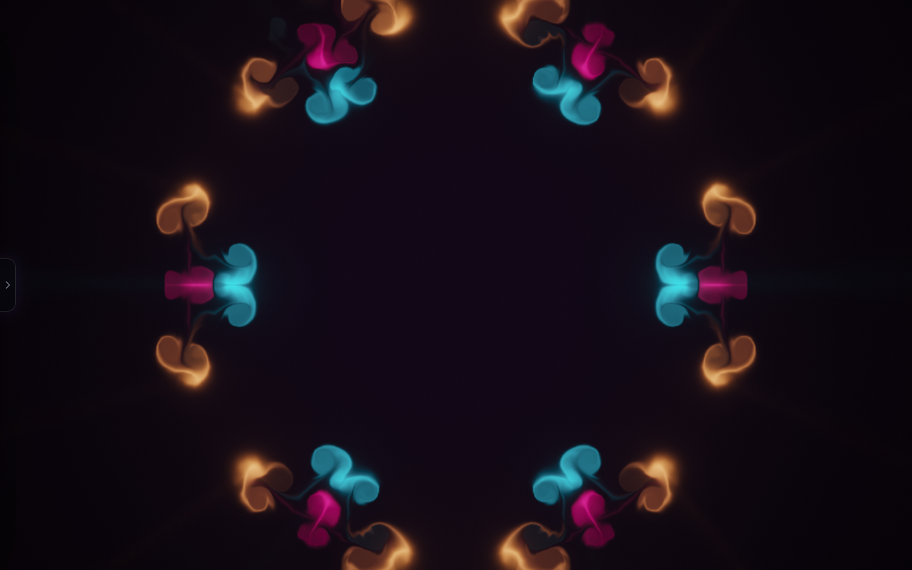
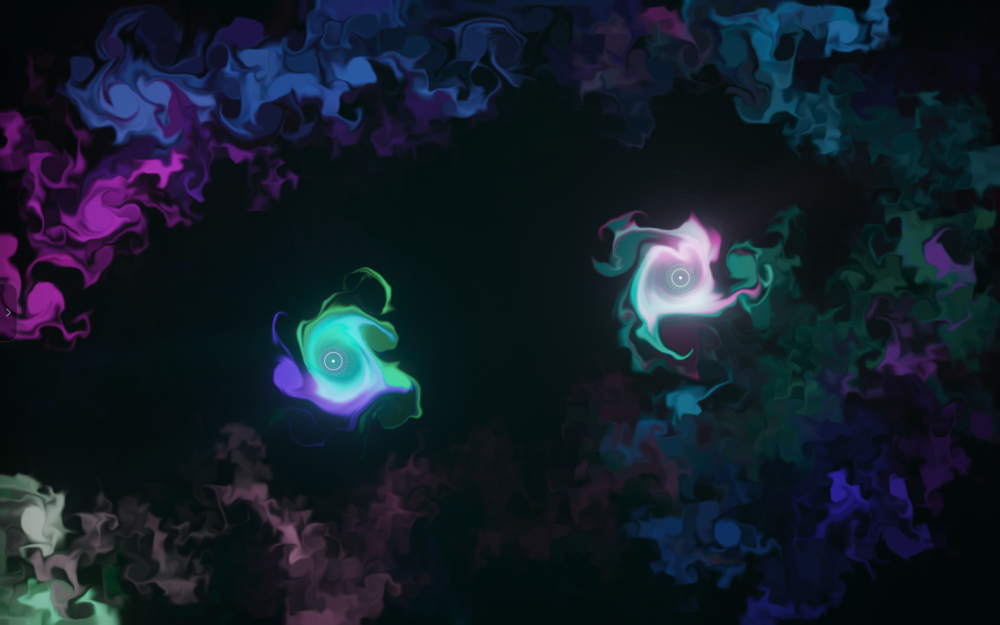
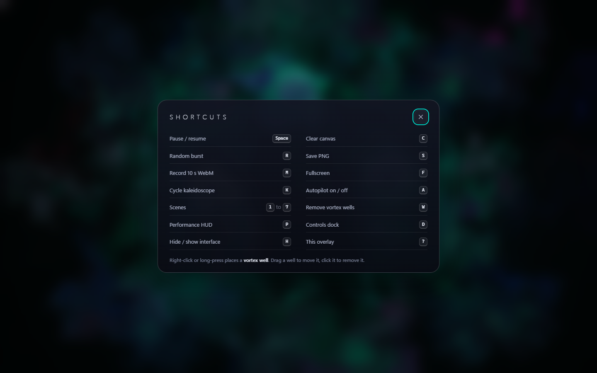
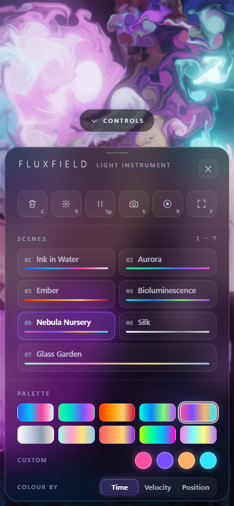

# FLUXFIELD

**A real-time GPU fluid and light instrument.** Hands-free it paints itself; under your cursor it is liquid light.


## Purpose

FLUXFIELD is a full-screen WebGL2 Navier-Stokes simulation that doubles as a generative-art instrument. It is for anyone who wants a
few minutes of something mesmerizing (a screensaver, a stage backdrop, a toy) and for engineers who want a compact, dependency-free
reference for a stable-fluids solver with a modern post-processing chain. It exists to show that a single folder of plain HTML, CSS
and JavaScript - no libraries, no build, no network - can drive a real GPU pipeline and still feel like a designed product.

## Feature tour

**Simulation.** Stable fluids on half-float render targets: curl, vorticity confinement, divergence, Jacobi pressure (iteration count
is a slider), gradient subtract, semi-Lagrangian advection of velocity and dye. Batched gaussian splats (up to 48 per draw) carry
pointer force. If the GPU cannot linearly filter float textures, the advection and display shaders switch to manual bilinear sampling.
Post chain: soft-knee threshold, dual-filter bloom, radial light shafts, tinted void, ACES filmic tone mapping, vignette, sRGB
encode and triangular dither.

**Conductor (hands-free).** On load, and after 8 s idle, an autopilot paints with Lissajous emitters bent by curl noise, a beat-driven
pulse layer (soft ticks, a big expanding ring every fourth beat), occasional bursts and a slowly drifting palette. Any pointer or
touch input hands control to you within a fraction of a second; it swells back in when you stop. Toggle with `A`.

**Seven scenes** (keys `1`-`7`, parameters crossfade over ~1.6 s and the old palette washes out): Ink in Water, Aurora, Ember,
Bioluminescence, Nebula Nursery, Silk (monochrome), Glass Garden.



**Instrument.**
- **Kaleidoscope** 2/3/4/6/8-fold, rotate or mirror (dihedral) - applies to you, the conductor and bursts.
- **Vortex wells**: right-click or long-press places a persistent spinning emitter (up to 6); drag to move, click to remove.
- **Palettes**: 10 curated plus a live 4-colour custom editor; colour by time, by direction of motion, or by position.
- **Capture**: native-resolution PNG, 10 s WebM recording (`MediaRecorder` on `canvas.captureStream()`), fullscreen, pause, clear, random burst.
- **Adaptive quality**: if sustained FPS drops under 45 the sim and dye grids scale down automatically; `P` shows the numbers.
- Settings persist in `localStorage`; touch and multi-touch work; on phones the dock becomes a bottom sheet.

 

 

## Run it

Double-click `index.html` (works from `file://`, fully offline, zero requests). Optionally: `python -m http.server` in this folder.
Needs a browser with WebGL2 and floating-point render targets; otherwise a friendly "WebGL2 required" panel is shown.

## Controls and keyboard shortcuts

| Input | Action |
|---|---|
| Move / drag | Paint (hover paints softly, press-drag paints stronger) |
| Right-click, long-press | Place / remove a vortex well (drag to move, click to remove) |
| `Space` | Pause / resume |
| `C` / `R` | Clear / random burst |
| `S` / `M` | Save PNG / record 10 s WebM (press `M` again to stop early) |
| `F` | Fullscreen |
| `K` | Cycle kaleidoscope (off, 2, 3, 4, 6, 8) |
| `1`-`7` | Scenes |
| `A` | Autopilot (conductor) on / off |
| `W` | Remove all wells |
| `P` | Performance HUD |
| `D` | Controls dock (also: left-edge hover, or the handle) |
| `H` | Hide / show the interface |
| `?` | Shortcut overlay; `Esc` closes panels |

## How it works

```
index.html            markup, icon sprite, dock skeleton, overlays
css/style.css         design tokens + all component styling (dock, sliders, segmented, switch, overlays)
js/util.js            math, seeded PRNG (mulberry32), 3D value noise + curl noise
js/shaders.js         GLSL ES 3.00 sources (one oversized triangle from gl_VertexID, no vertex buffers)
js/fluid.js           WebGL2 engine: format probing, FBO ping-pong, solver step, bloom/rays/composite, readback
js/scenes.js          scenes, palettes, slider definitions, the "look vector"
js/conductor.js       the hands-free choreography
js/ui.js              dock, overlays, toasts (a thin view over app state)
js/app.js             state, input, wells, symmetry, main loop, adaptive quality, capture
```

- **Look vector.** Everything a scene changes (brush, force, vorticity, fades, bloom, rays, exposure, background tint and the 12
  palette components) lives in one `Float32Array`; a scene change is a single eased lerp between two vectors.
- **Units.** Velocity is stored in sim texels/s but every public API speaks screen-heights/s, so behaviour is resolution independent;
  when the grid is resized the velocity field is rescaled with it.
- **Stability.** Vorticity confinement is clamped to 6 screen-heights/s and velocity/dye self-heal if a NaN/Inf appears (a
  Ember-at-low-FPS blow-up during development prompted this).
- **Splat batching.** Pointer strokes are interpolated into sub-splats; symmetry copies and conductor emitters share the same queue,
  flushed in at most two full-screen passes per 48 splats.
- **Adaptive quality.** Levels 1.0 / 0.78 / 0.6 / 0.45 / 0.33 scale both grids; drops one level after two consecutive sub-45 FPS
  seconds with a 3 s cooldown. Software renderers (SwiftShader, llvmpipe) start at 0.45 and cap DPR at 1 - real GPUs start at 1.0.
- **Automation hook.** `FF.app.probe()` renders and reads back the framebuffer to summarise it (used for verification).

## Mock data

There is no data. Everything is procedural; the only randomness is a seeded PRNG (`mulberry32`), so the conductor's choreography is
reproducible. No network requests of any kind.

## Design notes

- **Palette.** A black void; the fluid is the only light. The UI accent colour is taken from the live palette, so sliders, thumbs,
  switches and focus rings glow in the current scene's colour.
- **Type.** System stacks only: `Segoe UI Variable Display` (200-300 weight, very wide tracking) for the wordmark and titles,
  `Segoe UI Variable Text` for UI, `Cascadia Code` for numerals and key caps (tabular figures).
- **Motion.** Fade up from black with the conductor already flowing (the solver is pre-warmed before first paint); wordmark and hint
  fade out after ~9 s; spring easing on chips and the segmented pill; `prefers-reduced-motion` shortens fades and halves conductor speed.
- **Accessibility.** Buttons are real buttons with labels, toggles use `aria-pressed` / `role="switch"`, the dock opens on keyboard
  focus, focus rings are visible, the help overlay traps focus, ink colours clear WCAG AA on the glass.

## Limitations and ideas

- Recording and real-GPU frame rates could not be exercised in the headless test environment (see the summary).
- Pointer strokes are sampled per frame, so very fast flicks on a slow machine become straighter lines.
- Walls are solid; wrap-around edges would make the kaleidoscope seamless on square canvases.
- Ideas: audio-reactive conductor, scene morphs driven by MIDI, GIF export, a shareable preset URL.
- If the WebGL context is lost the page reloads itself (settings persist), rather than rebuilding GPU state in place.

## Post-Creation Summary

**Plan.** One IIFE per file under a single `FF` namespace, no modules. Build order: math/noise, shaders, engine, scenes, conductor,
markup and CSS, UI, app shell; then verify and tune.

**What was built.** About 2,100 lines across 9 files (index.html 159, style.css 366, app.js 522, fluid.js 370, shaders.js 236,
ui.js 222, conductor.js 106, scenes.js 71, util.js 60). Everything in the brief was implemented.

**Problems and fixes.**
1. *First render was close to right*, but the background read as navy, not black - the tint was cut to about a fifth and a touch of
   saturation was restored after ACES.
2. *Ember went fully black* in one run (high vorticity, sim running at dt 1/30, scene switched mid-flow). Added a velocity speed limit
   and NaN/Inf self-healing in the gradient and advect passes. The same Ember run from a fresh start was fine before and after; the
   exact failure was not reproduced after the fix, so this is a defensive change, not a proven root cause.
3. *Wells drew at the top-left corner*: the CSS entrance animation owns `transform`, which overrode the inline position. Fixed by
   positioning with the independent `translate` property. This was caught by reading a screenshot; the fixed overlay was re-shot.
4. Old dye lingered after scene changes at low FPS, so scene changes now add a temporary extra dye fade.
5. Per-stroke dye was slightly too dense and went flat pastel; amounts were reduced.
6. On a 390 px portrait canvas the same splat radius covers far more of the width, so the phone view washed out to near-white. Dye per
   splat is now scaled by the canvas aspect ratio (floor 0.4); the phone screenshot was re-shot and is visibly more saturated.

**Verified** (headless Edge, SwiftShader software WebGL2 via `tools/browse.mjs`, 1440x900 and a 390x844 touch emulation):
- Console clean (0 errors, 0 warnings) on load and through scene switching, real mouse drags, pointer-event-driven well placement,
  click-to-remove, symmetry cycling, overlay open/close, pause, hide UI, PNG capture and the record start/stop path. The only
  warnings seen come from the `probe()` readback hook (a driver "GPU stall on ReadPixels" notice), not from the app's normal operation.
- Pixels are not black or flat: framebuffer readbacks gave mean luma 8-79, std-dev 18-66, 340-730 distinct 4-bit colour buckets
  across scenes (the one near-black reading was the Ember run described above).
- localStorage persistence (settings JSON written and inspected), conductor yields on input (weight fell from 1.0 to 0.74 within two
  pointer moves and continues to fall), keyboard shortcuts `?`, Esc, P, Space, H, S, K, 1-7.
- Several screenshot review rounds of the hero, dock, scenes, kaleidoscope, wells, overlay and phone layouts.

**Not verified.** Real-GPU frame rate and the quality of adaptive downscaling on a real GPU (SwiftShader runs at 5-15 fps, so the
"software starts at 0.45" rule is what made it usable here); the automatic sub-45-FPS step-down was not observed in a recorded run;
WebM recording end-to-end (headless Edge delivered zero video frames to `MediaRecorder`, so only the start/stop/"no frames" path ran);
fullscreen; Safari/Firefox; context-loss recovery; a true touch device (touch emulation only, long-press was not exercised);
the 360 px phone width was shot but only skimmed.

**Screenshot notes.** The hero replays the wordmark and hint after 14 s because they fade out by design; hero is at quality "High"
on the software renderer, the other screenshots at "Med" or "Low" to keep test time reasonable.
