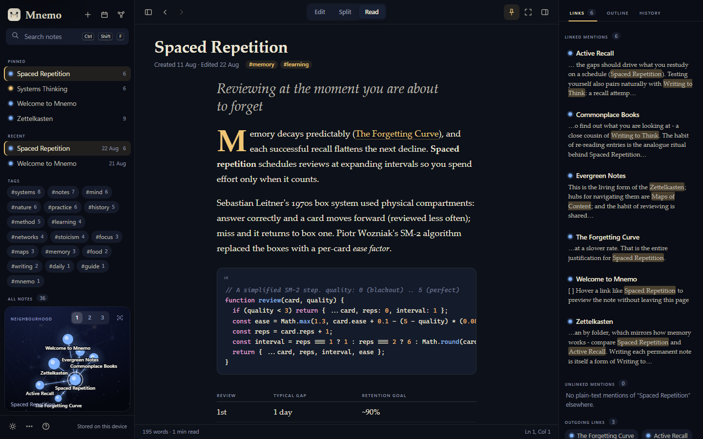
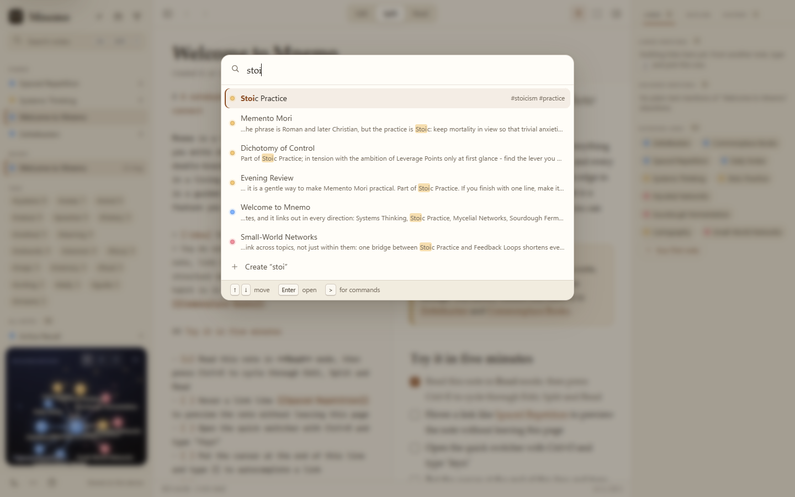
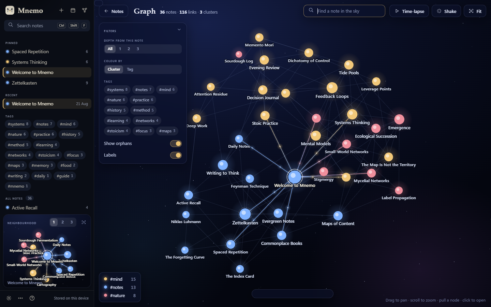
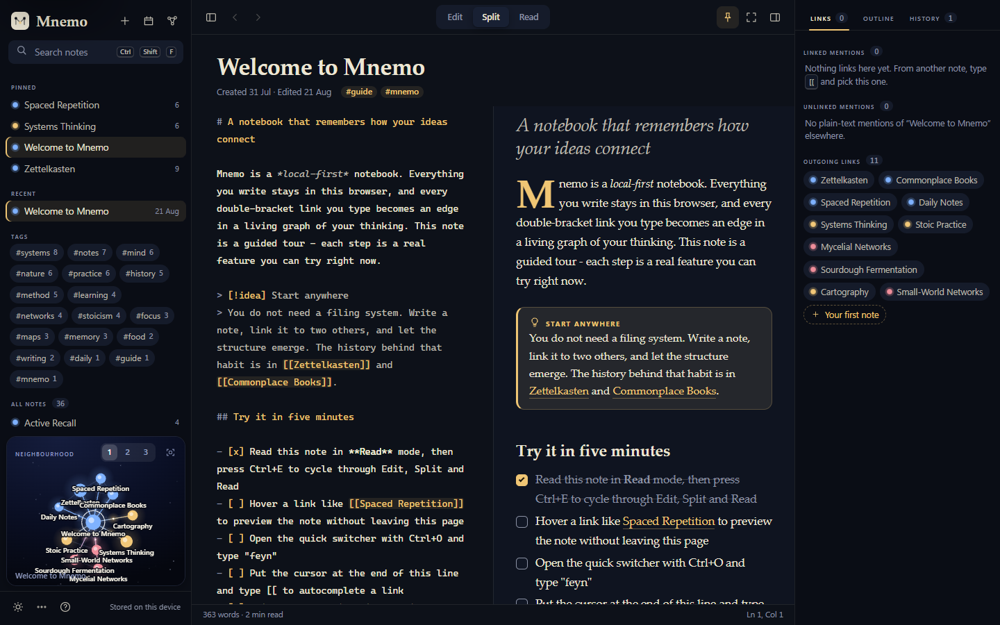
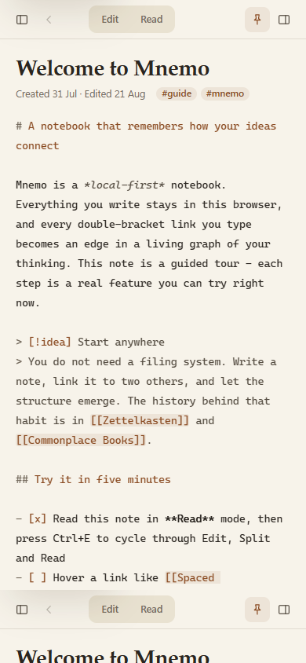

# Mnemo

**A local-first notebook with a living knowledge graph.** Write in plain Markdown, link ideas with `[[wikilinks]]`, and watch your notes organise themselves into a glowing map of clusters.


## Purpose

Mnemo is a showcase of what can be built with **no libraries at all**: a hand-written Markdown engine, a hand-written text editor surface, and a hand-written force-directed graph, wrapped in an editorial "paper, ink and starlight" interface. It is for people who think by writing and linking (Zettelkasten, evergreen notes, daily notes), and it demonstrates that a calm, premium writing tool, a real parser and a physics simulation can all live in ~3,500 lines of vanilla HTML, CSS and JavaScript.

The demo notebook holds 36 invented notes about *how to think with notes*: Zettelkasten, spaced repetition, systems thinking, the Feynman technique, sourdough fermentation, Stoic practice, cartography, mycelial networks, tide pools and more, densely cross-linked (172 links, 3 deliberately unresolved).

## Feature tour

**Writing**
- Three modes, **Edit | Split | Read** (`Ctrl+E`), with a smoothed scroll sync in Split. Panes slide between modes.
- Editor = a plain `<textarea>` with a syntax-highlighted `<pre>` painted underneath it (identical metrics), so it keeps native undo, selection and IME while showing coloured Markdown.
- Auto-closing brackets/quotes, list and quote continuation on Enter, Tab / Shift+Tab indent, `Ctrl+B` / `Ctrl+I` / `Ctrl+K` (link the selection), paste an image to embed it as a `data:` URI.
- `[[` opens a **fuzzy note-link autocomplete** (with a "Create" row); `/` opens a **slash menu** (headings, table, callouts, task, code, date, footnote, link to note).
- Autosave with a quiet "Saving / Saved" indicator, word count, reading time, cursor position.
- **Focus mode** (`Ctrl+.`) hides the chrome and uses typewriter scrolling.

**Markdown engine (from scratch)**: headings, emphasis, strike, highlight, inline and fenced code with js / json / python / css highlighting, blockquotes, nested ordered / unordered / **task lists (click a box in Read mode and the source line is edited)**, tables with alignment, rules, links, `data:`-only images, footnotes, `[[wikilinks]]` with `|alias` and `#heading`, `#tags`, and `> [!note]` / `idea` / `warning` / `tip` / `quote` / `question` callouts. Unresolved links are dashed and create the note on click. Hovering a wikilink shows a **preview card**.



**Knowing where you are**: a Links panel (linked mentions with context, **unlinked mentions with a one-click "Link it"**, outgoing links), an Outline that tracks your scroll, **History** (last 20 versions per note, with a diff-style preview and restore), a tag browser with counts, pinned and recent notes, back / forward navigation, ranked full-text **search** with highlighted snippets, a **quick switcher** (`Ctrl+O`) and **command palette** (`Ctrl+K` / `Ctrl+P`, or `>` in the switcher), a daily note (`Ctrl+D`) built from a template, **rename with automatic link updates**, delete with an **Undo** toast, export to JSON or a Markdown bundle (a hand-rolled `.zip` writer), and JSON import.



**The graph** (always a night sky, in either theme)
- Force-directed layout written from scratch: **Barnes-Hut quadtree** repulsion in typed arrays, link springs, gravity, damping and a cooling schedule that re-heats when you drag a node.
- Colour by **cluster** (label propagation, best of 14 seeded runs by modularity) or by tag. Node size follows connectivity; labels fade in by zoom level and importance with overlap culling.
- Hover dims everything except the neighbours; the active note's edges glow with **pulses travelling along each link**. Drag nodes, pan with momentum, wheel / pinch zoom, double-click to fit.
- A **neighbourhood graph** (depth 1-3) lives in the sidebar; the full-screen view adds search-to-highlight, tag filters, orphan and label toggles, depth filter, a legend and a **time-lapse** that replays how the notebook grew by creation date.



**Responsive**: three panes collapse to drawers at 1100 px and 820 px, and a bottom navigation takes over on phones.

 

## Run it

Double-click `index.html`. No install, no build, no network (zero external requests). Optionally `python -m http.server` in this folder.

Unit tests for the Markdown engine: `node tests/markdown.test.mjs` (run from this folder, or `node mnemo/tests/markdown.test.mjs` from the repo root).

## Controls and keyboard shortcuts

| Action | Keys |
| --- | --- |
| Quick switcher / command palette | `Ctrl+O` / `Ctrl+K` or `Ctrl+P` (`Ctrl+K` with text selected in the editor links the selection) |
| Search all notes | `Ctrl+Shift+F` |
| Daily note / new note | `Ctrl+D` / `Alt+N` |
| Edit - Split - Read | `Ctrl+E` |
| Graph view | `Ctrl+G` (Esc to leave) |
| Back / forward | `Alt+Left` / `Alt+Right` |
| Bold / italic | `Ctrl+B` / `Ctrl+I` |
| Save a version | `Ctrl+S` |
| Focus mode | `Ctrl+.` |
| Sidebar / context panel | `Ctrl+\` / `Alt+\` |
| Toggle theme | `Ctrl+Shift+L` |
| Shortcut overlay | `?` or `Ctrl+/` |
| Link autocomplete / slash menu | `[[` / `/` |

## How it works

```
index.html              markup for all panes and overlays
css/tokens.css          design tokens (colour, type, radii, motion), controls, scrollbars
css/app.css             layout grid, sidebar, context panel, palette, graph view, responsive rules
css/content.css         editor surface, source highlighting, rendered-note typography
js/markdown.js          the Markdown engine + source highlighter (also loads in Node for tests)
js/core.js              helpers, safe storage, fuzzy match, icon set, toasts
js/seed.js              the 36 demo notes
js/store.js             notes, link/tag index, search, history, rename, import/export, ZIP writer
js/graph.js             quadtree physics, label propagation, canvas renderer, interaction
js/editor.js            textarea + highlight layer, autocomplete, slash menu, key handling
js/ui.js                layout, sidebar, reader, context panel, palette, graph controller, shortcuts
tests/markdown.test.mjs 62 unit tests for the Markdown engine
```

Notable decisions:
- **Safety first in the parser.** All text passes through one `esc()`; the only HTML emitted is constructed by the engine. URLs are allow-listed (`http`, `https`, `mailto`, relative) after stripping control and zero-width characters; images must be `data:image/...`. Inline tokens are stashed behind placeholders so code spans and wikilinks inside code are never re-interpreted.
- **Link text stays in the flow.** The `<a>` open/close tags are stashed separately, so `[**bold** link](url)` still gets emphasis.
- **The editor never owns scrolling.** The `<pre>` defines the height, the `<textarea>` is absolutely positioned over it, and one wrapper scrolls, so there is no scroll-sync drift between layers. Programmatic edits go through `execCommand('insertText')` to preserve native undo.
- **Graph physics** follow d3-force's formulation (`velocityDecay`, `alpha` cooling) but with a typed-array Barnes-Hut tree. Labels use greedy rectangle culling ordered by importance.
- **State.** Notes and UI state live in `localStorage` inside `try/catch` with an in-memory fallback; versions are captured when you resume editing after a two-minute pause, or on `Ctrl+S`.

## Mock data

Everything is fictional or generic and written for this demo: note prose, the sourdough log, the decision-journal entry, dates. Historical references (Luhmann, Ebbinghaus, Meadows, Simard, Paine and so on) are summarised from general knowledge and should be treated as illustrative, not as citations; a few notes say so inline. Seed timestamps come from a seeded PRNG (`mulberry32`) relative to the day you first open the app, so layouts and clusters are reproducible (the graph layout uses fixed seeds; only the dates shown differ day to day). The forgetting-curve picture is an SVG generated once and embedded as a `data:` URI.

## Design notes

- **Palette.** Light: warm paper `#f7f3ea`, ink `#2a2520`, deep sepia accent `#8a4b22`. Dark: inky blue-black `#0d1119`, soft cream `#ece6d4`, a single luminous gold `#f0c674`. The graph and its sidebar porthole are always a night sky; cluster colours are luminous pastels chosen for that background.
- **Type.** Reading in the Iowan / Palatino / Georgia serif stack at a 68ch measure with a drop-cap option and an italic standfirst for the first heading; chrome in the system sans with small-caps labels; source and code in Cascadia / Consolas.
- **Motion.** Panels slide on a `cubic-bezier(.2,.7,.2,1)` curve, links draw their underline on hover, notes cross-fade in, toasts spring up. Everything respects `prefers-reduced-motion`.

## Limitations and ideas

- Single device, single browser profile; there is no sync. `localStorage` is small (about 5 MB) and images are embedded, so keep them small.
- Scroll sync in Split is proportional, not block-aligned, so long images can drift.
- No Markdown nesting of tables inside lists, no setext headings, no raw HTML (by design), and syntax highlighting covers only js / json / python / css.
- Label propagation is randomised; the best-of-14 seeded approach is stable but not guaranteed optimal. A Louvain pass would be better.
- Ideas: block references, transclusion `![[note]]`, canvas-based note cards, per-note aliases, a Web Worker for the physics on very large vaults, a proper IME / mobile keyboard pass for the autocomplete.

## Post-Creation Summary

**Plan.** One engineer-plus-designer pass in a single sitting: (1) the Markdown engine first, because everything else depends on it, with a Node test suite written beside it; (2) the store (index, search, rename, history, ZIP); (3) the seed notebook, validated by script so every `[[link]]` resolves except three on purpose; (4) the graph engine; (5) the editor layer; (6) the UI shell; (7) CSS and art direction; (8) verification and README.

**What I ran into.**
- The tool that wrote files turned a few `\uXXXX` escapes (NUL, line separator) in a regex into raw characters, which broke parsing in Node. I rebuilt that character class at runtime from code points and re-checked the file for raw control characters.
- The first browser run laid the whole app out at the height of its content, not the viewport: a CSS grid with no explicit row track. Fixed with `grid-template-rows: minmax(0, 1fr)`; the first hero screenshot caught it.
- The first full-screen graph showed an empty time-lapse pill because `display: grid` beat the `hidden` attribute; fixed with explicit `[hidden]` rules.
- Mobile drawers leaked a blurred shadow onto the screen edge while closed; the shadow now applies only when open.
- Several harness runs failed with "Could not attach to browser" or hung; the cause was stale headless Edge processes and running several instances in parallel. Running sequentially after clearing them was reliable.
- My scripted wikilink click initially "failed": the target link wrapped across two lines so its bounding-box centre landed on the paragraph. That was a script artefact, not an app bug (a synthetic click and a click on the first line box both navigate).

**Verified.**
- `node tests/markdown.test.mjs`: **62 passed, 0 failed.** Covers nested and loose lists, ordered starts, task line mapping, aligned tables with escaped pipes, nested blockquotes, callouts, footnotes, hard breaks, fenced code containing markdown / wikilinks / HTML, a longer fence containing a shorter one, wikilink alias / heading / unresolved forms, tag boundary rules, 26 XSS payloads (checked with a structural allow-list validator that rejects any unknown tag, event-handler attribute or `javascript:` / `data:` URL), source-highlighter round-trip (text preserved exactly), hostile inputs (5,000-character runs of `*`, `[`, backticks, `|`) and a 129 KB document in about 130-170 ms.
- A scripted run through the real harness (keys and mouse events) confirmed: Alt+N creates a note and focuses the title; Enter moves to the editor; typing `[[` + `feyn` shows "Feynman Technique" as the top autocomplete match and Enter inserts `[[Feynman Technique]]`; the rendered link resolves; a real click follows it; the backlinks panel then lists the linking note; sidebar search for "forgetting" returns ranked results; **renaming a note rewrote the `[[...]]` link in another note**. Separate harness runs confirmed the task-box toggle edits the source line, the quick switcher ranks "Stoic Practice" first for `stoi`, `Ctrl+G` opens the graph (36 nodes, 3 clusters), and both themes render.
- Screenshots reviewed: hero (light split), dark split, dark read mode, full-screen graph, quick switcher, phone (390 px). Several rounds led to the grid fix, `[hidden]` fix, mobile shadow fix and mini-graph label culling.
- Console: **0 errors and 0 warnings** on every harness run that completed (load, graph, switcher, read mode, mobile).

**Not verified (be sceptical here).**
- Daily note creation, theme-toggle shortcut, hover preview card, command palette execution and the `?` overlay were exercised in code and partly by screenshot (switcher, graph), but my last scripted pass over those steps failed on a script error and I did not get it re-run, so they have not been confirmed end to end by automation.
- The graph time-lapse, filters, tag colouring mode, node dragging and touch / pinch gestures were not driven by a script or captured in a screenshot.
- Export / import and the ZIP file were not opened in an external tool; the ZIP writer follows the format (stored entries, CRC-32, UTF-8 flag) but is untested against an unzipper.
- Tablet widths (768-1024) and a 2560 px monitor were not screenshotted; only 1440 x 900 and 390 x 844.
- Real-device mobile keyboards, IME composition, and Safari / Firefox were not tested (the harness is Chromium only). The editor relies on `document.execCommand`, `color-mix()` and CSS lookbehind, all fine in current Chromium.
- Accessibility was designed in (labels, roles, focus rings, reduced motion) but not audited with a screen reader.

**Size.** 12 source files, about 3,500 lines (index.html 193, CSS 356, JS 2,864 including the 749-line seed, tests 120), no dependencies, no network requests.
