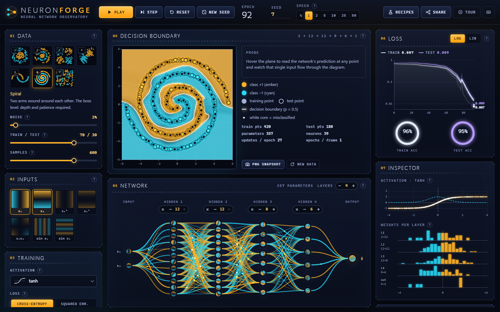
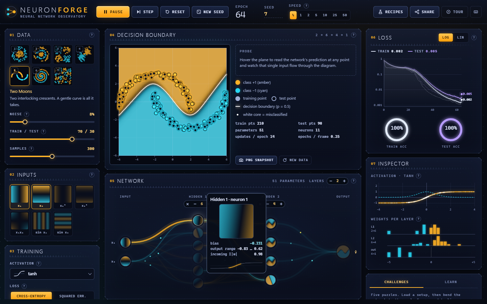
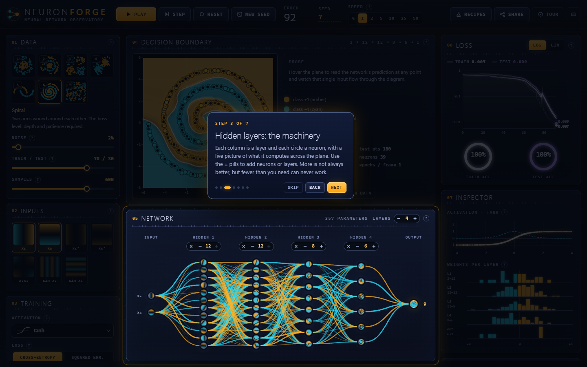
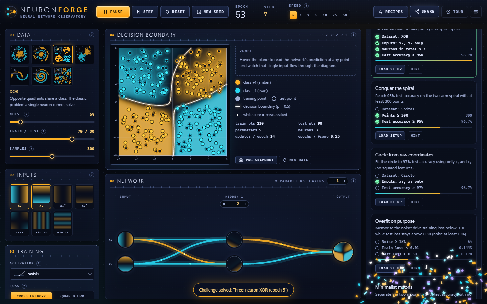
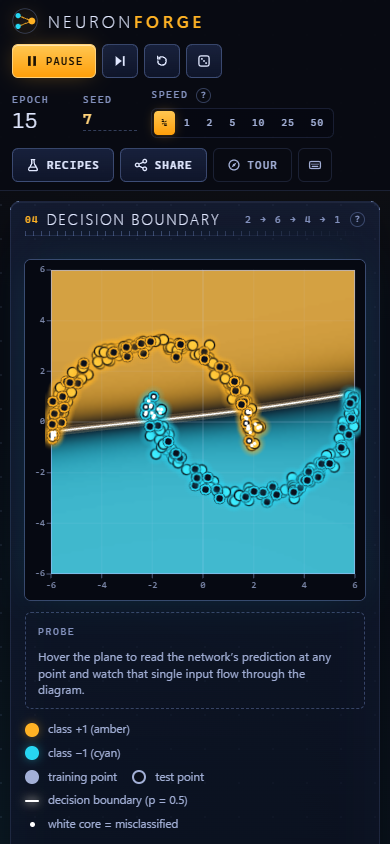

# NEURON FORGE

**Watch a neural network learn, live.** A from-scratch neural-network laboratory: real backpropagation, a decision boundary that breathes as it trains, a live picture inside every neuron, challenges, recipes and a guided tour. No libraries, no network, no build step.


## Purpose

Neuron Forge is a teaching instrument in the spirit of the TensorFlow Playground, built to show how much a dependency-free front end can do. It is for anyone learning why hidden layers, activation functions, learning rates and regularisation matter. It is also a showcase of three things at once: a hand-written ML engine (dense layers, manual backprop, three optimisers), dense real-time canvas visuals, and a polished, accessible UI built without a framework.

Everything you see is computed live in the page: every heatmap pixel inside every neuron, every edge thickness and every loss value comes from the actual network being trained.

## Feature tour

**The engine** (`js/engine.js`, `js/lab.js`)
- Dense MLP with 0-6 hidden layers of 1-12 neurons, `Float32Array` math and hand-written backprop.
- Activations: tanh, ReLU, Leaky ReLU, sigmoid, swish, linear. Losses: cross-entropy or mean squared error. Optimisers: SGD, Momentum, Adam. L1/L2 regularisation, batch size, Xavier/He init.
- Seeded RNG: seed, data cloud, initial weights and shuffle order are all reproducible. `Reset` replays the identical run (checked bit-for-bit, see Verification).
- Seven synthetic datasets (Circle, Ring and Core, XOR, Gaussian clusters, Two Moons, Spiral, Checkerboard) with noise, train/test split and sample-count controls.
- Seven toggleable input features (x1, x2, x1^2, x2^2, x1*x2, sin x1, sin x2), each with a thumbnail of what it looks like over the plane. The input layer adapts.
- Changing the architecture while training **morphs** the network: surviving weights are kept and new neurons start quiet, so you can add a neuron mid-run and watch the effect rather than starting over.

**The visuals**



- **Decision boundary**: a 120x120 field, bilinearly upscaled, in a diverging amber (+1) / cyan (-1) palette with a luminous marching-squares contour at p = 0.5. Training points are solid, test points ringed, and a white core marks any point currently misclassified. Hover for the exact prediction, a crosshair and a live feed of that single input flowing through the network diagram.
- **Network diagram**: neurons are discs containing a live heatmap of what each one computes; input discs show the raw feature, the output disc shows the prediction. Edges are coloured by sign and weighted by magnitude with additive glow; signal particles drift along them while training. ReLU neurons that have died are striped red.



- **Hover a neuron** to isolate its edges, dim the rest and open a close-up with bias, output range and its activation curve. **Click an edge** to open a scrubber and set that weight by hand (zero it, flip its sign, or drag).

- **Add / remove neurons and layers** with the pills directly on the diagram; the layout re-flows with a spring tween.
- **Loss chart**: train and test, log/linear toggle, a smoothed trail that brightens toward "now", end-value callouts and a hover read-out. **Accuracy rings** count up. **Activation plot** shows f and f' with a live rug of real pre-activation values. **Weight histograms** per layer.

**Learning layer**
- **Guided tour**: seven spotlight steps (inputs, hidden layers, weights, activation, loss, overfitting), auto-opens on first run, dismissible, re-openable.



- **Learn tab**: a short, plain-language explanation of every control, the same text that powers the hover `?` chips.
- **Challenges** (live scoring, confetti on success, progress saved in `localStorage`): Three-neuron XOR, Conquer the spiral (95% test), Circle from raw coordinates (97%), Overfit on purpose (train loss < 0.01 and test loss > 0.30), Minimalist moons (97% with at most 4 neurons).



- **Recipes** (ten one-click experiments): "A single neuron can't do XOR" vs "Two hidden neurons can", the x1*x2 cheat, circle in squared space, deep spiral, checkerboard with sine features, overfit on purpose, tame it with L2, and learning rate far too high / far too low.
- **Share**: copy a URL-hash link of the whole configuration, export / import JSON (file or paste), and a PNG snapshot of the boundary with a title strip.

**Responsive**: three-column app layout on desktop, two columns at 1180 px and below, and a stacked single column with a sticky transport bar on phones.



## Run it

Double-click `index.html`. No install, no server, no network; it works from `file://`. Optional: `python -m http.server` and open <http://localhost:8000/>.

Engine tests (needs Node, no packages): `node tests/verify-engine.cjs`.

## Controls and keyboard shortcuts

| Key / control | Action |
|---|---|
| `Space` | Play / pause (when no button has focus; on a focused button Space activates that button, as usual) |
| `S` | Step one epoch |
| `R` | Reset weights from the same seed, keep the data |
| `N` | New seed (new data and weights) |
| `1` - `7` | Choose dataset |
| `?` | Shortcut overlay |
| `Esc` | Close menu, dialog, edge scrubber or tour |
| Tour: `Left` / `Right` / `Enter` | Back / next |
| Speed (1/4, 1, 2, 5, 10, 25, 50) | Epochs of training per animation frame |
| Seed field | Type a number and press Enter to replay a specific run |
| Layer pills on the diagram | Add or remove neurons (`+` / `-`) or a whole layer (`x`) |
| Click edge / hover neuron / hover plane | Weight scrubber / neuron close-up / prediction probe |

## How it works

```
index.html          shell + inline SVG icon sprite
css/style.css       design tokens, glass panels, hand-styled controls, responsive rules
js/engine.js        seeded RNG, activations, Net (forward, backward, SGD/Momentum/Adam)
js/data.js          7 dataset generators, 7 input features
js/lab.js           experiment state: config, data, net, training loop, history, morphing, config sanitiser
js/kit.js           amber/cyan palette + LUT, slider/segmented/select/menu/tooltip/toast widgets
js/content.js       help text, recipes, tour script
js/boundary.js      heatmap, marching squares, point sprites, PNG snapshot, thumbnails
js/netview.js       network diagram: node DOM, edge + particle canvas, hover cards, edge scrubber
js/charts.js        loss chart, gauges, activation plot, weight histograms
js/challenges.js    challenge definitions, live scoring, confetti
js/tour.js          spotlight tour
js/main.js          UI construction, rAF loop, wiring, share/import, keyboard
tests/verify-engine.cjs   gradient check + headless training + reproducibility (node)
```

Key decisions:
- **One flat parameter buffer.** Weights, gradients and optimiser moments are parallel `Float32Array`s. The optimiser is a single loop, and the gradient check just perturbs `net.P[k]`.
- **Output layer follows the loss.** Cross-entropy uses a sigmoid output with the stable `softplus` form; MSE uses tanh with targets of +/-1. Both reduce to cheap output deltas (`y - t`, and `(y - t)(1 - y^2)`).
- **Time-sliced training.** Each frame runs `speed` epochs but never more than ~11 ms of work, so the UI stays at 60 fps even for big nets at x50. Visual refreshes are decoupled and throttled (boundary adapts to its measured cost; neuron maps ~11 Hz; charts ~20 Hz).
- **Canvas for volume, DOM for interaction.** Up to ~800 edges and 500 particles are painted on one canvas; neurons are DOM discs so hover, animation and click come free. Edges are hit-tested against their sampled Bezier curves.
- **Imported configs are untrusted.** `NF.sanitizeConfig` whitelists keys and clamps every value, so a pasted link or JSON file can't inject anything.
- **No globals beyond `window.NF`** (plus `window.NFApp`, a small debugging handle used by the verification scripts).

## Mock data

There is no external data at all. Every dataset is synthetic and generated at load time from a seeded PRNG (mulberry32 + Box-Muller): the same `(seed, dataset, noise, samples)` always yields the same points. Challenges and recipes are fictional teaching setups. Nothing is read from or sent to anywhere; `localStorage` (guarded by try/catch) only remembers your last configuration, whether you have seen the tour and which challenges you solved.

## Design notes

- **Midnight observatory**: `#070a12` canvas, hairline borders, registration corner-marks and ruler ticks on every panel, tracked-caps mono micro-labels, and a light-weight display face (Segoe UI Variable Display / system stack). No web fonts.
- **One semantic colour pair**: phosphor amber means positive (class +1, positive weights, excited neurons), cyan means negative everywhere. Train / test are deliberately *not* amber or cyan: ice-white and violet, so they can't be confused with class colours.
- **Motion**: staged panel entrance, spring-tweened network re-layout, eased gauges and count-ups, glow pulses on focus. `prefers-reduced-motion` removes decorative motion: no particles, no confetti, snapped layout, and training does not auto-start.
- **Accessibility**: real buttons, radio groups and checkboxes, labelled sliders with `aria-valuetext`, visible focus rings, a focus-trapped tour and keyboard-operable custom dropdown. Canvas content is described and the pills offer the same structural edits as the diagram.

## Limitations and ideas

- Single-output binary classification only; no regression or multi-class view.
- Training runs on the main thread. It is time-sliced and file:// safe, but a 6x12 network with x50 speed makes the page feel slightly heavier. A Web Worker (needs a server or blob URL) would fix that.
- The morph-on-resize is a heuristic. Shrinking a layer mid-run can strand the network in a local minimum (the three-neuron XOR challenge says to press Reset after shrinking for that reason).
- Two-neuron XOR with tanh is genuinely hard to optimise: in my seed scan only 2 of 16 seeds solved it, versus 10 of 16 with swish, which is why the challenge and recipe use swish.
- The edge scrubber edits one weight at a time; there is no "freeze weight" option, so training keeps pulling on it unless paused.
- Ideas: a regression mode, a "dead neuron" detector with a fix-it button, activation / gradient flow animation per layer, a local-storage gallery of saved experiments.

## Post-Creation Summary

**Plan and phases.** I built the engine first and verified it before any UI: `engine.js` (RNG, Net, optimisers), `data.js` and `lab.js`, then a node harness (`tests/verify-engine.cjs`) that gradient-checks and trains headlessly. Only then the front end: CSS design system and HTML shell, UI kit, boundary view, network view, charts, challenges/tour, and finally the controller in `main.js`. Content (help text, recipes, tour) was written once and reused for tooltips, the Learn tab and the tour.

**What was verified (actually run).**
- *Gradient check:* analytic backprop vs centred finite differences (eps 1e-6, float64 buffers, L1+L2 on, random biases) for all 6 activations x both losses = 12 combinations. All pass; worst relative error 3.6e-6 (BCE + linear), typically 1e-8 to 2e-7.
- *Headless training (node, test split accuracy):* XOR with 4 hidden tanh neurons 98.9% in 36 epochs; XOR with only 2 hidden neurons (swish, seed 7) 98.9%; XOR with no hidden layer stays at 62% (as it must); circle with x1/x2 and [4,3] 100%; circle with squared features and no hidden layer 100%; two moons 98.9%; ring and core 100%; spiral with all 7 features [8,8,6] 99.2% in 68 epochs; **spiral with raw x1/x2 only and [12,12,8,6] 100% in 76 epochs** (also reproduced in the browser: 92 epochs to 100% test on the 600-point recipe); checkerboard with sine features only 92.2% after 1500 epochs.
- *Reproducibility:* same seed gives bit-identical weights after 40 epochs; `Reset` replays the identical run.
- *Browser (headless Edge via `tools/browse.mjs`):* zero console errors or warnings on load and through every scripted interaction: neuron hover, edge click and scrubber, recipes menu (10 items) and share menu (both opened, screenshotted and closed with Esc), keyboard shortcuts 3 / Space / S / N / R / ?, the spiral recipe running to solved, the moons recipe, and a full challenge win: loading Three-neuron XOR, shrinking to 2 hidden neurons, pressing Reset, and the app awarding the challenge at epoch 51 with the toast and confetti. Screenshots were reviewed at 1440x900 (first load, mid-training spiral, solved spiral, neuron hover, edge popover, tour steps 1 and 3, recipes menu, share menu, challenge win), 1024x768 (after a fix), 768x1024 and a 390x844 phone viewport.

**Problems hit and fixes.** (1) The first gradient check "failed" with errors of ~1.0 because activations were `Float32Array`; swapping every buffer to float64 inside the test fixed it and showed the maths was fine. (2) Two-neuron XOR with tanh failed on most seeds, so I scanned seeds and activations rather than hiding it, and made swish the documented route. (3) The hover card and edge scrubber were clipped by the bottom of the diagram; they now measure themselves and clamp. (4) The first palette was flat and over-bright; the LUT now has a darker midpoint and a restrained peak so points and the contour carry the contrast. (5) Loss-chart ticks were sparse on a short log range, so minor 1-2-5 ticks were added. (6) At 1024 px the panels overlapped (the app-shell grid was still height-locked); the tablet breakpoint now lets the page scroll, and I re-shot 1024 to confirm. (7) In the challenge run, shrinking the XOR net from 4 to 2 hidden neurons *without* pressing Reset got stuck at 86.7% after 3000 epochs, while Reset-then-train solved it at epoch 51; the challenge hint now says to press Reset.

**What was not verified.** Firefox and Safari (only Edge/Chromium); a real touch device (the phone shot is emulation, and touch drags on sliders/edges were not exercised); screen readers; `prefers-reduced-motion` mode (implemented, never run); the PNG snapshot download, clipboard copy, file-picker import and JSON export (the share menu opens and builds a valid 389-character link, but the downloads and the import path were not exercised); a scripted walk through all seven tour steps (steps 1 and 3 were captured; the run that stepped through the rest was lost to a headless-browser crash, so steps 2 and 4-7 were not viewed); the 768 px layout after my last CSS tweak (a `max-width` on the boundary plot; the 768 shot predates it); and long runs (> 10 minutes) for leaks. The very first screenshot had the first-run tour auto-open; later ones suppress it with a localStorage flag. I achieved about three review passes on the main desktop state, fewer on secondary states.

**Process notes.** The brief's 20-25 minute box was not met: the build took roughly an hour of wall-clock time, a good part of it waiting on a heavily loaded machine where the headless browser harness was intermittently slow or failed to attach (I wrapped it in a retry script). The deadline was extended by the orchestrator. Scope was cut to finish: no per-frame Web Worker, no regression mode.

**Final size.** 14 files in the app folder tree, about 2,900 lines in total: `index.html` 153, `css/style.css` 433, 11 JS files about 2,200 lines, and `tests/verify-engine.cjs` 87.
