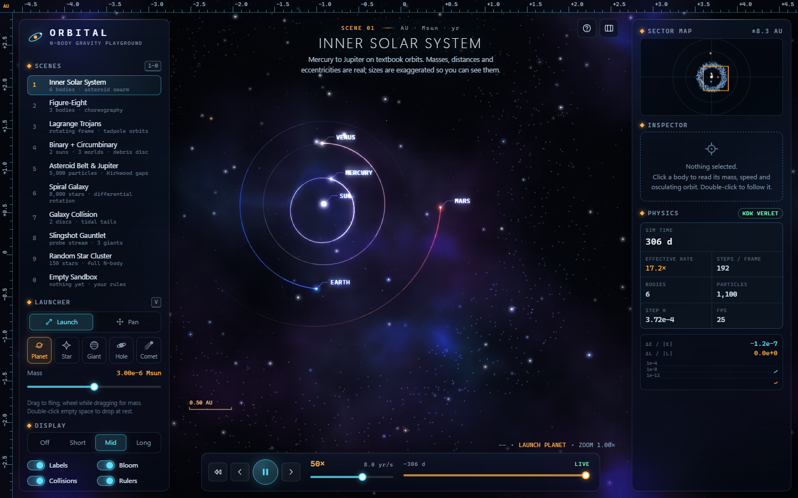
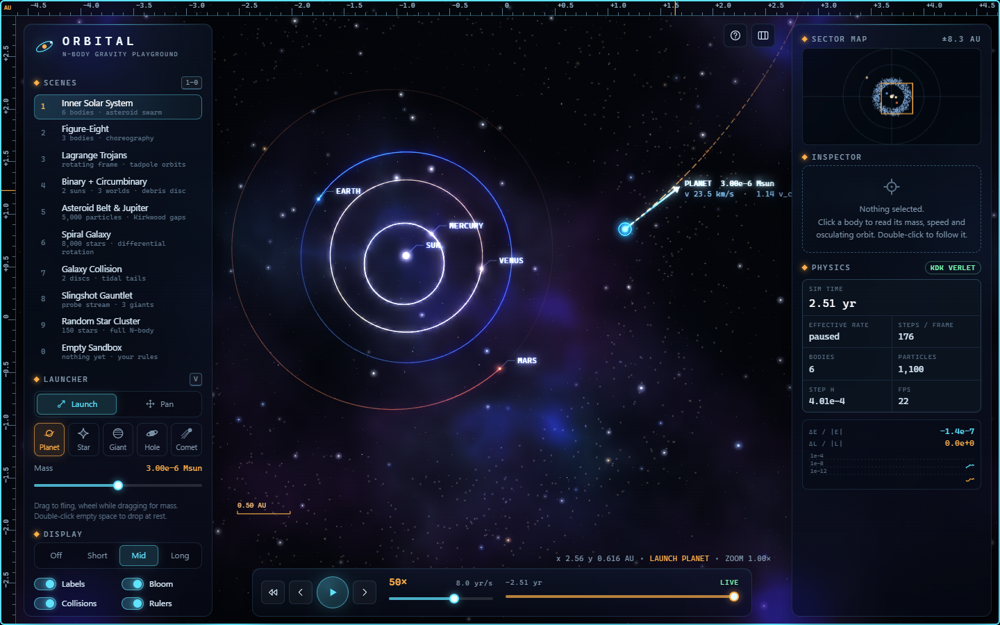
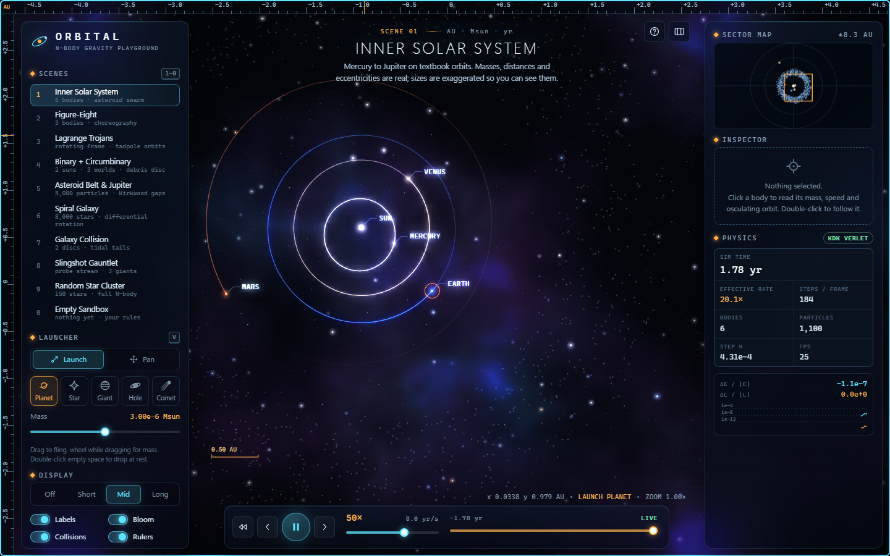
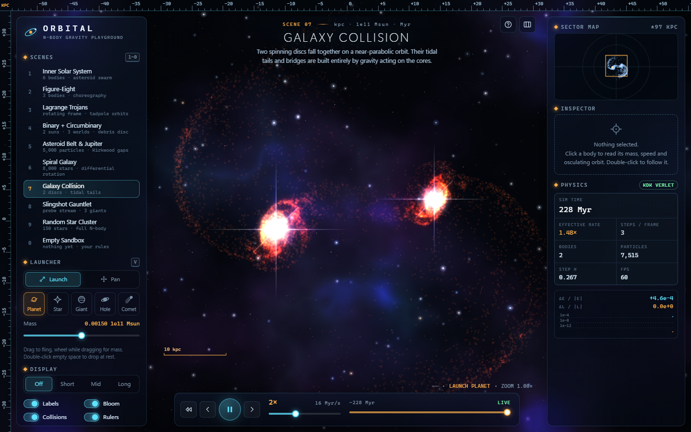

# ORBITAL - an N-body gravity playground

Fling planets, stars and black holes into a live gravity simulation, scrub time backwards, and watch the integrator's
energy drift in real time. Mission-control HUD over a procedural deep-space backdrop.

## Purpose

A single-page showcase of a serious simulation wrapped in a serious interface: a reversible symplectic integrator,
thousands of test particles at interactive rates, and a hairline instrument-panel UI - all hand-rolled (no libraries, no
network, no build step). It is for anyone who wants to *play* with gravity for an hour, and for anyone evaluating what
a single-session build can do with plain HTML, CSS and JavaScript.

## Feature tour

**Physics**
- Kick-drift-kick **velocity Verlet** (symplectic, time-symmetric), Plummer-softened, with **chunked adaptive
  substepping**: the step is `eta x` the shortest pairwise dynamical/crossing time, re-chosen every 8 steps.
- **Smart split**: up to 256 massive bodies interact pairwise (O(N^2)); up to 24,000 light test particles feel the
  massive bodies only (O(P*M)). This is what lets galaxy scenes carry 8,000 particles. (Barnes-Hut was deliberately *not*
  used; see Limitations.)
- Collisions merge bodies with conserved mass and momentum, mass-scaled radius (volume-conserving; linear for black
  holes), a flash and a debris burst. Black holes swallow bodies and particles and flare an accretion ring.
- **Live diagnostics**: dE/|E| and dL/|L| with a log-scale sparkline; baselines re-set on discrete events (merges, additions).
- **Time**: pause, 0.05x to 2000x, true **reverse** (negative-step integration) and a scrubbable snapshot history
  (about 40 MB budget, roughly 10-20 s at 8k particles). Crossing a snapshot while rewinding restores it exactly, which also un-merges collisions.
- If the CPU cannot keep up at high speed, the sim throttles and the **Effective rate** readout turns amber rather than lying.

**Scenes** (keys 1-0): Inner Solar System (real masses / semi-major axes / eccentricities, labelled), Figure-Eight
(Chenciner-Montgomery), Lagrange Trojans (co-rotating camera frame), Binary + circumbinary planets with a debris disc,
Asteroid Belt & Jupiter (live semi-major-axis histogram with resonance markers), Spiral Galaxy (8k stars),
Galaxy Collision (two discs), Slingshot Gauntlet, Random Star Cluster (150 stars, full N-body), Empty Sandbox.

**Interaction**: drag to fling with a glowing velocity arrow and a live **predicted path** (forward-integrated copy of
the system including the new body's own pull; red X on predicted impact); wheel while dragging sets mass; five body types
(planet, star, gas giant, black hole, comet with a particle tail); wheel-zoom about the cursor; middle/right/shift drag or
the Pan tool to pan; click for the inspector (mass, speed, distance to dominant attractor, osculating a / e / period /
peri-apo, plus a dashed osculating-orbit ghost); double-click a body to follow it; **O** co-rotates the view with the selected body.
Touch: one finger launches/taps, two fingers pan and pinch.

## Run it

Double-click `index.html`. No install, no server. (Optional: `python -m http.server` in this folder.)
Numerical tests: `node tests/physics.test.mjs` (Node 22).

## Controls

| Input | Action |
|---|---|
| Drag (Launch tool) | Fling a body; arrow length = speed, 80 px = local circular speed |
| Wheel while dragging | Mass of the new body |
| Wheel | Zoom about cursor |
| Mid / right / Shift drag, or Pan tool (`V`) | Pan |
| Click / double-click body | Inspect / follow |
| Double-click empty space | Drop a body at rest |
| `Space` `R` `[` `]` `.` | Pause, reverse, slower, faster, single step |
| `1`-`0` | Scenes |
| `T` `L` `B` `U` `M` | Trails cycle, labels, bloom, rulers, collisions |
| `F` `O` `C` `H` `?` `Esc` | Follow, co-rotate, clear, hide UI, help, cancel |

## How it works

| File | Role |
|---|---|
| `js/util.js` | Seeded PRNG (mulberry32), number formatting, colour maths |
| `js/physics.js` | `Sim` (SoA typed arrays, KDK step, adaptive chunks, merges, snapshots, elements) and `predictPath` |
| `js/presets.js` | The ten scenes, Kepler-state helper, disc / ring builders |
| `js/render.js` | Backdrop, bodies, trails, particles, bloom, rulers |
| `js/app.js` | Camera, time control, input, inspector, minimap, plots |
| `tests/physics.test.mjs` | Node numerical checks |

Rendering notes: test particles are splatted bilinearly into a half-resolution additive `ImageData` buffer (coloured
through a 64-entry speed LUT), then upscaled with `lighter` compositing, so dense regions saturate to white like real
long exposures. Bloom is a four-level downsample chain (the first level threshold-ed with `ctx.filter`) re-added with `lighter`.
The backdrop is a tileable periodic-noise nebula plus three star tiles, parallaxed against camera motion.
`window.__orbital` exposes internals for scripted verification.

## Mock data

Everything is synthetic or textbook-approximate. Solar-system numbers are rounded published values; every other body
(Veyra, Tharsis, Nimbus, Harrow, all particles) is invented. Initial conditions are generated from seeded PRNGs, so each
scene is reproducible. Figure-eight initial conditions are the published Chenciner-Montgomery/Simo values. Bodies are drawn
with exaggerated radii so they are visible.

## Design notes

Palette: near-black blue `#03060c`, instrument cyan `#5fe3ff` for interactive state, amber `#ffb04a` for measurement and warnings.
Type: Segoe UI Variable Display for headings (light, wide-tracked caps), Cascadia Code / Consolas for every number
(tabular). Frosted-glass panels with a hairline top highlight, edge rulers with live scale, a measured scale bar. Motion:
staggered panel entrance, a 7 s camera dive into the Solar System, eased scene changes; `prefers-reduced-motion` collapses animations.
Below 900 px the side panels become drawers.

## Limitations & ideas

- **No Barnes-Hut.** Massive bodies are O(N^2) (cap 256) and test particles do not attract each other, so the galaxies
  are restricted three-body style, with no self-gravity (no real bars or density waves; arms are seeded and wind up).
- The Kirkwood gaps are accelerated by boosting Jupiter 5x; the real timescale is far too long for a demo.
- Rewind is exact only between snapshots and across merges via snapshot restore; trails are not rewound.
- Collisions are inelastic merges only (no fragmentation physics, debris is cosmetic and gravitating).
- Scene units are approximate (galaxy time unit about 1.5 Myr is derived from a 1e11 Msun core).
- Ideas: Barnes-Hut for self-gravitating discs, 3-D tilt, save/share scenes, orbital-element editing.

## Post-Creation Summary

**Plan and phases.** Brief -> engine first (physics + tests in Node before any UI) -> scenes -> renderer -> HUD/app shell -> verification.
Physics was written and tested headlessly first; belt parameters were tuned with a throw-away Node script
(Jupiter x3 opened gaps only after ~10 kyr; x6 wiped the outer belt; x5 was chosen as a compromise - not further tuned).

**Numerical results (`node tests/physics.test.mjs`, all run and passing at the time of writing):**
- Two-body circular orbit, 200 orbits, adaptive step (h = P/420): max |dE/E| = 1.25e-8 (limit 1e-4), max |dL/L| = 1.8e-14.
- e = 0.9 orbit: adaptive stepping (3.4k steps) reached max |dE/E| 1.7e-3 vs 9.3e-3 for a fixed step with 4.6x more steps. Honest note: 1.7e-3 is not great for this extreme orbit.
- Figure-eight, 20 periods: max return error 7.9e-3, radius stays under 1.09, min separation 0.69, max |dE/E| 7.3e-5.
- Time reversal, solar system + 1,100 particles, 4,000 steps forward then 4,000 back: bodies return within 6e-13 AU, particles within 8e-13 AU.
- Merge conserves momentum (1e-16) and mass.
- Throughput in Node: about 180 M particle-body interactions/s (8k particles, 3 bodies: ~7,300 steps/s).

**Browser verification (Edge headless via `tools/browse.mjs`, SwiftShader software GL):** zero console errors or warnings on load and through the
scripted interaction (load, 50x speed, click a planet to open the inspector, pause, drag-fling with predicted path, release).
Screenshots reviewed: intro in progress, settled Solar System, inspector, fling, Galaxy Collision at t = 228 Myr (tidal tails and bridge visible, 60 fps in that run). Headless frame rate was ~20 fps at
1440x900 with 1,100 particles (software rendering; not representative of a GPU machine).

**Problems hit.** (0) Figure-Eight hang, see above. (1) `browse.mjs` failed to attach when launched from the Git Bash tool but worked from PowerShell, and a
later run hung once; this cost the last ~15 minutes and is why some checks below are missing. (2) Debris was spawned inside the merged body and absorbed
instantly - found by the merge unit test, fixed by spawning outside the new radius. (3) The first nebula was far too bright; toned down after the first screenshot.

**UPDATE (later re-test by the orchestrating session):** the Figure-Eight scene loaded and ran in headless Edge with no hang and
no console errors (3 bodies, dE/|E| about -7.7e-6 after a short run, about 24 fps under software rendering), and the run then went on
to load the Empty Sandbox and complete a drag-fling with a predicted path. The earlier hangs were most likely the harness leaking
browser processes (since fixed in `tools/browse.mjs`), not the scene. Spiral Galaxy (7,979 particles, dE/|E| about 2e-7) and a 390 px mobile
layout were also reviewed. The original note follows, kept for the record. **KNOWN OPEN BUG (superseded):** loading the Figure-Eight scene inside the headless harness hung the scripted run twice (the page or harness stopped responding; no console error was reported and the same initial conditions run fine in Node). I ran out of time before finding the cause, so treat the Figure-Eight scene in the browser as **unverified and possibly broken**; the other scenes I loaded (Solar System, Galaxy Collision) worked.

**Not verified (be sceptical of these):** the 8k-particle fps benchmark (scripted but the run that would have reported it did not
complete), Figure-Eight and the remaining scenes (Trojans, Binary, Belt, Spiral, Gauntlet, Cluster, Sandbox) *visually* in the browser (physics-tested in Node only), the mobile layout and touch gestures (CSS written, never
screenshot or touch-tested), keyboard shortcuts other than the pointer flow above, reverse/scrub in the browser UI (engine
verified in Node), belt histogram and Trojans co-rotation visuals, and the dark/light and reduced-motion modes. No design-review
loop beyond roughly two rounds was done.

**Size.** 6 source files (`index.html`, `css/style.css`, 5 JS files) + 1 test; about 2,500 lines in total.
