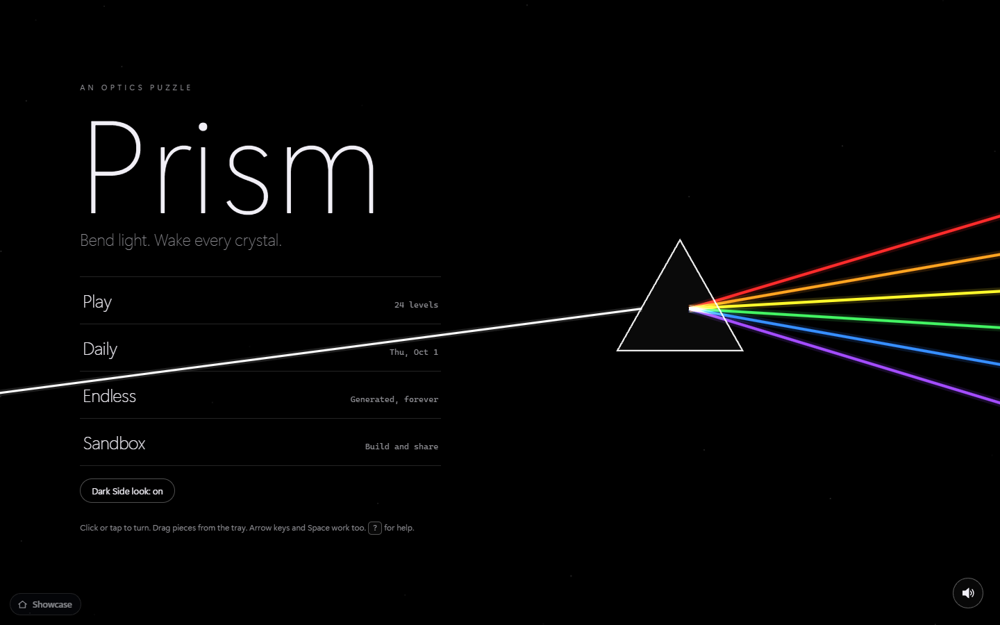
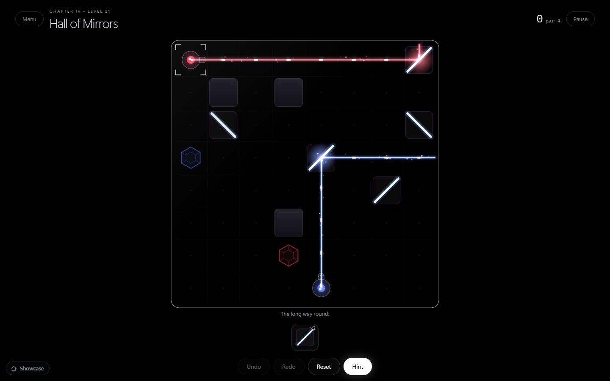

# PRISM

**Bend light. Wake every crystal.** A dark-glass optics puzzle: rotate mirrors, split beams, mix colours, step through portals.

> **Update (later verification by the orchestrating session):** the UI has since been run in headless Edge through the project harness.
> The title screen, the 24-level select map and level 1 ("First Light") render correctly with **0 console errors and 0 warnings**, and a
> real mouse click on the mirror solved level 1 and produced the 3-star win card ("1 moves - par 1"). Four screenshots now exist in
> `screenshots/`. Levels 2-24, drag and drop from the tray, audio, Daily / Endless / Sandbox, Hint and mobile are still **unverified**.
>
> **Original status, stated plainly (written before that update; parts are now superseded):** the game logic is tested and all 24 levels are solver-proven, but **the UI was never run in a browser**. The headless harness (`tools/browse.mjs`) failed with "Could not attach to browser" on every attempt because the machine was saturated by other parallel builds (hundreds of Edge processes). The only UI check was `node --check js/app.js` (syntax). So there are **no screenshots** (`screenshots/` is empty), and console cleanliness, layout, drag and drop, audio and the scripted three-level UI playthrough are all **unverified**. Expect bugs in `js/app.js`. Everything under "Verified" below was actually run.

## Purpose

A flagship showcase of a game built with zero dependencies: a linear, per-channel beam tracer, a lit-guided puzzle solver that backs the Hint button, a reverse-built puzzle generator for the Daily and Endless modes, a synthesized Web Audio score and a canvas renderer with a cheap bloom pipeline. Open `index.html` and it works offline (no network, no CDN, no build step).

## What shipped

**24 handcrafted levels** in four chapters (Reflection, Division, Spectrum, Convergence). Each chapter introduces one idea at a time:

| Chapter | Levels | New mechanics |
|---|---|---|
| I. Reflection | 1-6 | mirrors, the tray, walls, crossing beams, fixed pieces |
| II. Division | 7-12 | splitters and power halving, coloured emitters, two-beam crystals, absorbers, full-power ringed crystals |
| III. Spectrum | 13-18 | prisms, additive mixing (R+G=yellow, G+B=cyan, R+B=magenta, all=white), colour filters |
| IV. Convergence | 19-24 | portal pairs, a long 8x8 board, prism plus portal, a three-colour mixing desk, a finale |

Also in the code: **Daily puzzle** (seeded by the local date), **Endless** (random seeds, difficulty ramps), **Sandbox** with base64 share codes (Export/Import), Hint (runs the solver and highlights one correct action), undo/redo, reset, pause menu, par-based stars (3 at par, 2 within +3, otherwise 1), progress saved in `localStorage` inside `try/catch`, a constellation level map, a looping title scene (white light through a prism), synthesized audio (rising pentatonic chimes per crystal, a low hum, a remembered mute) and `prefers-reduced-motion` support.

## Dark Side look (optional)



A second visual look, switched on from the title screen (**Dark Side look: on / off**) or the pause menu, and remembered on the device. It changes the
presentation only; levels, scoring and the solver are untouched. Everything goes to pure black and monochrome: the title shows one thin white beam
meeting a crisp triangle and leaving it as a six-band spectrum (red, orange, yellow, green, blue, violet). In play, the board is black with a white
outline, beams are hard thin lines with a tight coloured halo instead of a soft bloom, and the magenta accents become white.



This is an original homage to the classic "white light into a prism, spectrum out" image, which is a physics diagram as much as anything else. It uses
**no band name, album title, logo, typeface or artwork**, and it is not affiliated with or endorsed by any musician or label. If the project is ever
used beyond an internal demonstration, have the visual identity reviewed by whoever owns brand and legal for it.

**Verified:** toggling from the title and the pause menu, persistence in storage, title and three levels (including a prism level and the 8x8 board)
screenshotted, 0 console errors, 41 tracer tests still pass. **Not verified:** colour-contrast measurement of the white accents, other browsers, and
touch. The "Ambience hum" is unrelated and still off by default.

## Run it

Double-click `index.html`. Optional: `python -m http.server` in this folder.

Tests (node 22): `node tests/test-core.mjs` and `node tests/solve-all.mjs` (add `--skip-daily` for just the 24 levels).

## Controls

| Input | Action |
|---|---|
| Click / tap a piece | rotate 90 degrees |
| Right-click, `Q` | rotate back (`E` rotates forward) |
| Drag from tray onto the board; drag a placed piece off the board | place / return it |
| Tap a tray piece, then tap a cell | place (touch friendly) |
| Arrow keys, `Space` / `Enter` | move cursor; rotate, or place the selected tray piece |
| `1`-`9`, `Del` / `X` | select tray piece; send the piece under the cursor back |
| `Ctrl+Z`, `Ctrl+Y` | undo, redo |
| `H`, `R`, `M`, `Esc`, `?` | hint, reset, mute, pause, help |

## How it works

```
index.html        screens + overlays
css/style.css     design tokens, layout, overlays
js/core.js        pure logic (no DOM): tokens, tracer, solver, generator, share codes. Also runs under node
js/levels.js      the 24 levels as ASCII layouts, chapters, star thresholds
js/app.js         audio, canvas renderer, input, screens, persistence
tests/            test-core.mjs (tracer unit tests), solve-all.mjs (solver over levels + generated seeds)
```

**Tracer.** Every element acts on the red, green and blue channels independently, so the optical system is linear. `trace()` propagates each channel recursively over a field of (cell, direction) intensities: mirrors reflect, splitters halve into two branches, prisms send R left / G straight / B right (only when entered through their flat face), filters pass a channel mask, portals teleport to their partner, walls/absorbers/emitters/crystals swallow light. Additive mixing and recombination fall out because intensities simply accumulate. Guards: a cycle guard (a state already on the recursion stack stops), an intensity floor (0.03), a depth limit and an operations cap. A crystal is lit when the primaries above 0.2 power exactly equal its colour, from at least `n` distinct directions; ringed crystals need 0.9 power per needed primary.

**Levels are authored solved.** A level is written as its solved layout; `buildLevel()` scrambles the rotatable pieces and lifts "loose" pieces into the tray, so every level is solvable by construction. The solver then re-proves it independently from the scrambled state.

**Solver.** Light-guided: only pieces and empty cells that light currently touches can matter, because in any solution every relevant piece is lit by something upstream. Phase 1 is a bounded BFS over single actions (move-optimal, finishes for most hand-made levels); phase 2 is a "locked" depth-first search that decides the first-lit undecided piece, tries each orientation, then moves on, placing tray pieces on lit empty cells when nothing lit is left undecided. The Hint button calls the same solver from the current board.

**Generator.** Grows beams outwards from emitters (random runs, turns with mirrors or splitters, optional white emitter plus prism fan), ends each branch in a matching crystal, adds walls, verifies the layout with the tracer, then pulls some mirrors into the tray and knocks the rest out of position. Seeds come from `mulberry32(hash32(...))`.

**Rendering.** Beams are merged into straight runs and drawn with three additive passes plus a travelling pulse; the light layer is downscaled to a quarter size and drawn back additively for bloom. Crystals shatter into shards and a ring when first lit. Pieces spring toward their rotation angle.

## Verified (actually run)

- `node tests/test-core.mjs`: **41 tracer assertions pass** (mirror reflections in several directions, splitters branching and halving, power threshold, additive mixing R+G / G+B / R+B / white, excess colour spoiling a crystal, prism dispersal and wrong-way absorption, filters, portals including a portal next to its partner, walls/absorbers/crystals as terminals, two-beam and full-power crystals, feedback loops terminating with bounded intensity, share-code round trip and rejection of garbage).
- `node tests/solve-all.mjs`: **24 of 24 levels proven solvable** by the solver starting from the scrambled state, each also confirmed solved in its authored layout and *not* already solved at the start. Most are move-optimal (BFS). It found two problems that were fixed: level 6 had a shortcut (blocked with a wall), level 12 was solved at the start (redesigned). Level 21 still has a 4-move optimum, below my authored 8, so its par is set to 4.
- Generated puzzles: an earlier solver version solved only 130 of 200 daily seeds within its time limit. The solver was then reworked (causal ordering of the locked DFS) and spot-checked on 8 seeds (8 of 8 solved, 0.002 to 2.1 s each). **The full 200-seed run with the final solver is recorded below only if it finished; otherwise it was not completed.**

**200 generated daily seeds (final solver): the solver found a solution for 147, and did NOT within its 4 s limit for the other 53** (44 of the 147 were move-optimal BFS, 103 DFS; average solver length 7.3 moves vs average authored par 9.4; slowest 9.3 s). The test machine was heavily loaded by parallel builds, so some timeouts may be load, but I did not confirm that. All 200 are solvable by construction (the generator builds the solved layout first and the tracer verifies it), so the shortfall is solver speed on bigger boards, not unsolvable puzzles. It also means **Hint can take several seconds or fail on harder Daily boards**. Endless mode: 11 of 12 sample seeds solved in the earlier solver run. The goal of "solver proves all 200 seeds" was **not met**.

## Not verified

- Anything in a browser: rendering, layout at any size, mobile, console errors, drag and drop, keyboard play, audio, the map, the win overlay, the sweep transition, Sandbox export/import.
- The "play three levels through the UI" test. There is no `tests/ui-play.mjs`; it was not written.
- Hint latency on the largest generated boards (the solver may take up to about 1.5 s there).

## Limitations and ideas

- Pieces are double-sided mirrors (two logical orientations); one-sided mirrors would add depth.
- Hint can only rotate/place; if the player has parked pieces uselessly it asks them to take pieces back instead of suggesting a removal.
- Sandbox has a fixed 9x7 board and no portal pairing UI beyond placement order; share codes carry the board only, not a tray.
- No live beam preview while dragging (the ghost piece only), no per-level screenshots, no full-screen constellation animation.

## Mock data

There is no external data. Every level, name and tip is invented for this app; Daily and Endless puzzles are generated from a seeded PRNG.

## Design notes

Palette: matte black `#07070a`, glass surfaces at 4% white, one magenta-violet accent `#c04bff`. Beam primaries are tinted (red `255,70,90`, green `90,255,120`, blue `90,120,255`) so additive mixing reads as yellow, cyan, magenta and white. Type: Segoe UI Variable Display at weight 200 for display text, Cascadia Code for numerals. Motion: spring-eased rotation, pop-in placement, crystal shatter, a beam-sweep transition; all suppressed under reduced motion.

## Post-Creation Summary

**Plan.** Build the logic first and prove it, then put a UI on it: `core.js` (tracer, solver, generator), `levels.js` (24 authored layouts), unit tests, then a single-file renderer/UI.

**What happened.** The logic phase went well. The first solver (BFS then plain DFS) solved all 24 levels but only about two thirds of the generated daily seeds, because the search space exploded; the fix was a "locked" DFS that decides each lit piece once, in the order light reaches it. Writing levels as solved layouts and scrambling them meant none were unsolvable, but the solver caught two design flaws (a shortcut in level 6, and level 12 being solved on load) and one over-generous par (level 21). A mid-build time limit forced the UI into one `app.js` rather than separate audio/render/game files.

**Problems.** The verification harness could not attach to a browser, repeatedly, because the host was overloaded by parallel builds; shell commands themselves began timing out. I ran out of time before getting a single screenshot.

**What was and was not verified.** See the sections above: logic and solver verified in node; UI unverified apart from a syntax check. I did not do the three mandated visual-review rounds, did not test mobile, and cannot claim the UI is console-clean.

**Size.** 8 files: `index.html` (91 lines), `css/style.css` (115), `js/core.js` (449), `js/levels.js` (217), `js/app.js` (607), `tests/test-core.mjs` (159), `tests/solve-all.mjs` (44), this README.
