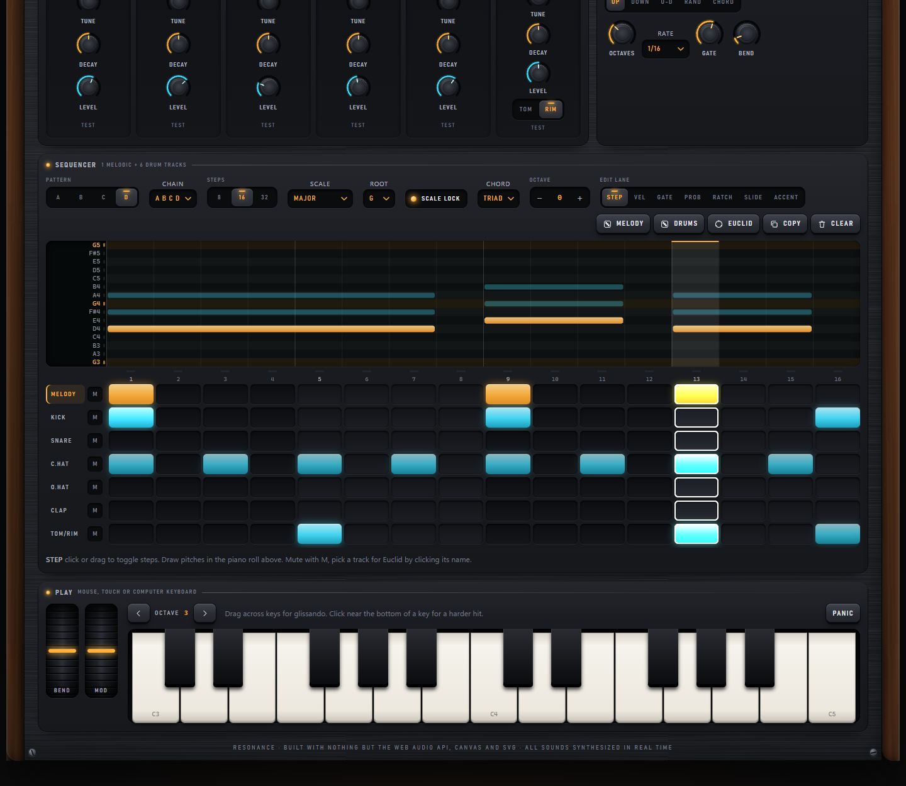
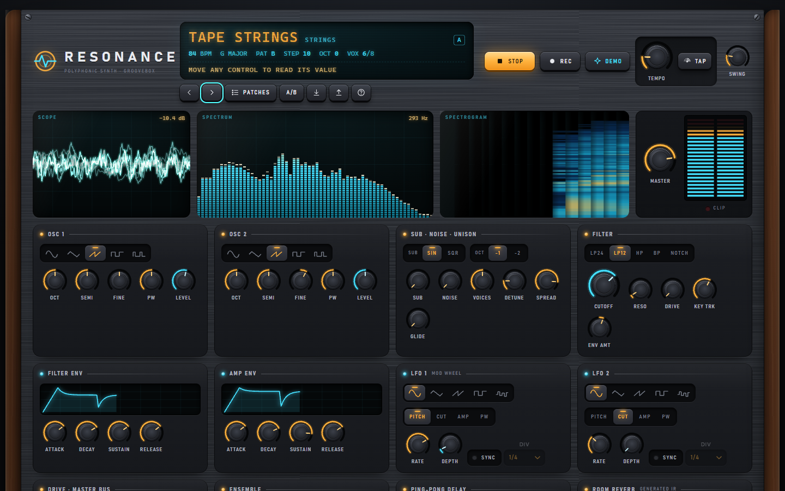
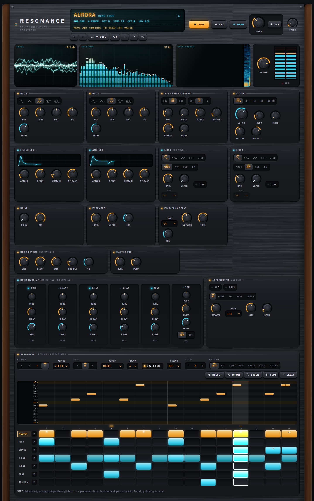
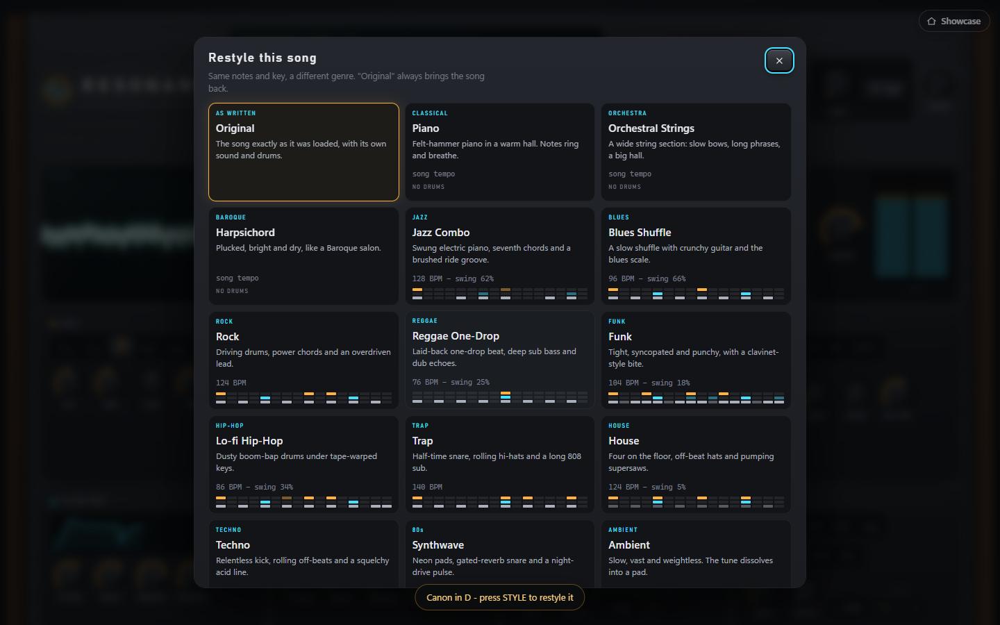
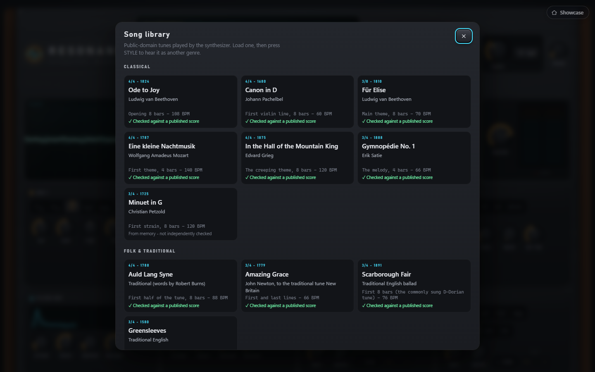
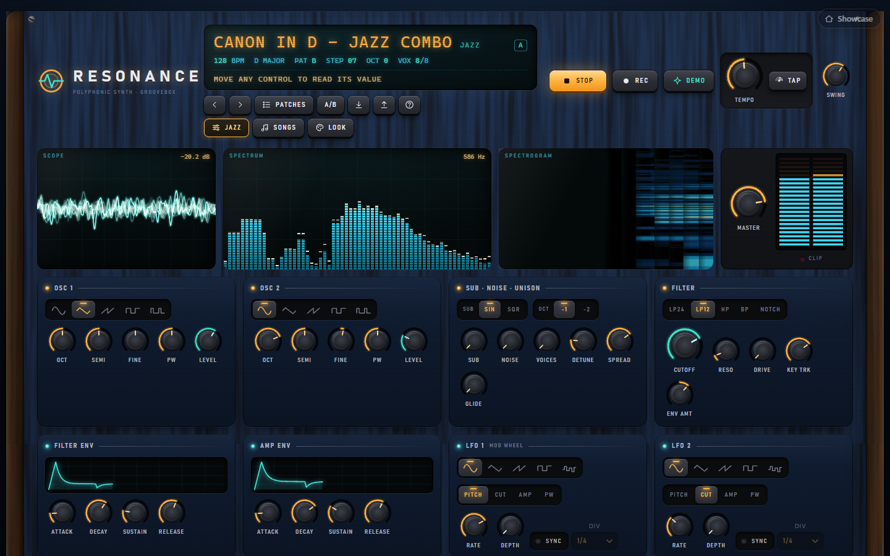
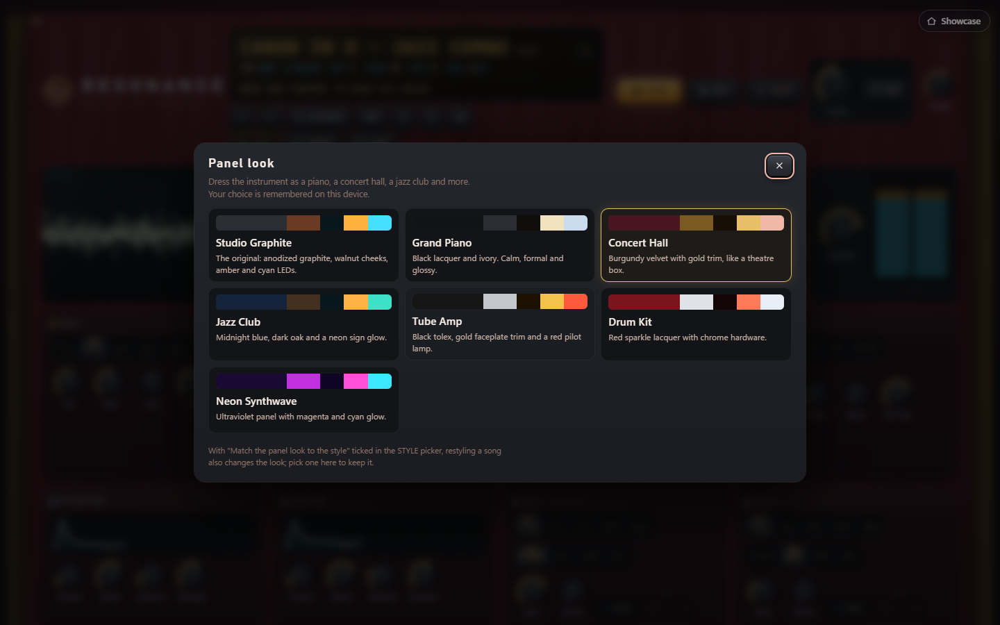

# RESONANCE

**A polyphonic synthesizer, drum machine and step sequencer, rendered as boutique hardware in glass and light. Every sound is synthesized live with the Web Audio API. No samples, no libraries, no network.**

## Purpose

RESONANCE is a showcase of what a single folder of plain HTML, CSS and JavaScript can do: a complete groovebox with a real audio engine, a sample-accurate sequencer and a hand-built hardware-style interface. It is for anyone who wants to play with sound in the browser, and it demonstrates Web Audio graph design, look-ahead scheduling, procedural DSP (including a generated convolution reverb), and a custom SVG / canvas widget toolkit.

**Important honesty note:** the build environment had no speakers and nobody listened to this app. Sound design is based on established synthesis recipes and was checked numerically (see Post-Creation Summary), not by ear. Expect to tweak patch levels and taste.

## Feature tour

**Synth voice** (8-voice polyphony with oldest/quietest voice stealing, glide)
- Two oscillators (sine / tri / saw / square / PWM pulse) with octave, semitone and fine tune, plus sub oscillator and noise.
- Unison 1-7 voices with detune and stereo spread.
- Multimode filter: LP24 and LP12 (cascaded biquads), HP, BP, notch, with resonance, pre-filter drive, key tracking and its own ADSR + amount.
- Amp ADSR with live envelope graphs; two LFOs (sine / tri / saw / square / sample-and-hold) routed to pitch, cutoff, amp or pulse width, free-running or tempo-synced. The mod wheel pushes LFO 1 deeper.
- PWM is built as *saw minus a delayed copy of itself*, so it is band-limited and the width is modulated by an LFO at audio rate.

**FX chain**: saturation, three-voice ensemble chorus, tempo-synced ping-pong delay with tone control, and a **procedurally generated convolution reverb** (decaying, progressively darker stereo noise plus early reflections, regenerated and cross-faded when size / decay / damping move). Master bus: glue compressor, limiter, soft-clip guard and a kick-triggered "pump".

**Drum machine**: kick, snare, closed hat, open hat (choked by the closed hat), clap and tom/rim, each with tune / decay / level and a TEST button. Oscillator sweeps and filtered-noise envelopes only.

**Sequencer**
- Look-ahead scheduler ("tale of two clocks"): a 25 ms `setTimeout` loop schedules events 140 ms ahead on the `AudioContext` clock.
- 8 / 16 / 32 steps, swing, 60-200 BPM with tap tempo, four pattern slots A-D with queued switching and chain presets (AB, ABC, AABA ...).
- One melodic track (piano-roll pitch editor, gate, velocity, accent, slide/tie, probability, ratchet) plus six drum tracks.
- Scale lock (12 scales) with root note, chord stacks (5th, triad, 7th, sus, octave) that stay in key, Euclidean generator per track, and scale-aware "dice" for melody and drums.
- Edit lanes turn the step buttons into bar editors for velocity, gate, probability, ratchet, slide and accent.

**Playing**: two-octave piano (mouse / touch / glissando, velocity from click height), computer keyboard (A W S E D F T G Y H U J K O L P ;), Z / X octave shift, hold latch, spring-back pitch bend wheel, mod wheel, and an arpeggiator (up / down / up-down / random / chord, 1-4 octaves, rate, gate) that locks to the sequencer grid.

**Presets**: 13 factory patches, each with matching four-pattern demo material (Aurora, Glass Pad, Sub Pressure, Pluck Theory, Neon Arp, Tape Strings, Acid Line, Velvet Keys, Hollow Bell, Wobble Engine, Sunrise Lead, Kalimba Rain, Init Saw). Save and load your own in `localStorage`, import / export JSON, and A/B compare. **DEMO** loads *Aurora* (A minor, i-VI-III-VII, arpeggio + house drums) and starts playing.

**Recording**: REC captures the master bus to a lossless 16-bit stereo WAV (a ScriptProcessor tap that exists only while recording) and downloads it.

**Visuals** (all driven by real `AnalyserNode` data, and they "breathe" when silent): phosphor-persistence oscilloscope, log-frequency spectrum with peak hold, scrolling spectrogram, stereo LED meter with clip latch.

## Style, Songs and Look (added in the second round)

**STYLE** (header, under the LCD) restyles the song that is playing into another genre while keeping its makeup: the same notes, key and pattern
structure. Fourteen genres: Piano, Orchestral Strings, Harpsichord, Jazz, Blues, Rock, Reggae, Funk, Lo-fi Hip-Hop, Trap, House, Techno, Synthwave
and Ambient. A style swaps the sound patch, tempo, swing and drum kit, writes a genre-appropriate groove for every pattern (groove, variation, break
and a fill on the last bar), and adjusts how the melody is played (velocity, note length, slides, a touch of deterministic humanising). Blues also
locks the melody to the blues scale. **Original** always brings the song back exactly as it was loaded.

**SONGS** is a library of 12 public-domain tunes: Ode to Joy, Canon in D, Fur Elise, Eine kleine Nachtmusik, In the Hall of the Mountain King,
Gymnopedie No. 1, Minuet in G, Auld Lang Syne, Amazing Grace, Scarborough Fair, Greensleeves and Jingle Bells. Each is an excerpt of up to 8 bars that
loops, written as a one-voice transcription and played by this app's own synthesis. **Only the compositions are public domain**: no recording and no
modern arrangement is used, because those are separate works with their own copyright. Each tile carries a badge: *Checked against a published score*
means an automated test compared every note and length with a public-domain score; *From memory* means it was not (Minuet in G, Greensleeves and Jingle Bells are the three such tunes).
Pick a song, then press STYLE to hear it as jazz, techno or anything else.

**LOOK** changes the panel's skin: Studio Graphite (the original), Grand Piano, Concert Hall, Jazz Club, Tube Amp, Drum Kit and Neon Synthwave. The
choice is remembered on the device. By default a style also suggests a look (Jazz gets the Jazz Club, Synthwave gets Neon Synthwave); untick "Match the
panel look to the style" in the STYLE picker to switch that off. Going back to Original returns to the look you picked yourself.

Smaller changes: pattern lengths of **12 and 24 steps** were added for waltz and 6/8 material (appended to the step list so saved patches keep working),
and a hidden **TRIM** level (not shown on the panel) evens out loudness between styles.

**What was verified for this round.** 8,472 automated logic checks across all 12 songs, 14 styles and 5 pattern lengths (notes stay in range and in key,
nothing is lost on restore, bar lengths are correct), with 0 failures, plus a negative control to prove the checks can fail. 45 offline renders
(3 songs, 15 variants): none produced NaN or clipping, every style ended within about 2.5 dB of the target loudness (-20.5 dBFS RMS) except Reggae
(about -23 dB, limited by its peak level), and peaks stayed at or below about -3.3 dBFS. The UI was driven in a headless browser: opening the pickers, loading
a song, restyling it, the LCD text and the look changing, with no console errors.

**What was NOT verified.** Nobody has listened to any of it. Whether a style sounds like its genre, and whether a song's tempo and feel are right, is a
matter of ear. Real mouse clicks on the new buttons were tested; touch was not. Minuet in G, Greensleeves and Jingle Bells are from memory. Several well-known tunes were left out on
purpose: Moonlight Sonata, The Planets, The Four Seasons (long and multi-voice, and a one-voice excerpt would not do them justice), the ragtime and
early jazz titles (their identity is the stride-piano left hand, which this single-voice format cannot honestly carry), and recordings of any kind. If
you can supply a public-domain score or MIDI file for a tune you want, it can be added and checked the same way.

## Run it

Double-click `index.html`. No install, no server. Click **Power on** (browsers require a gesture before audio can start), or *Power on and play the demo loop*. Optional: `python -m http.server` in this folder.

## Controls & keyboard shortcuts

| Input | Action |
| --- | --- |
| Space | Play / stop |
| Shift + Space | Start / stop recording |
| 1 2 3 4 | Pattern A-D (queued to the next bar while playing) |
| `[` `]` (Shift = 5) | Tempo -1 / +1 |
| A W S E D F T G Y H U J K O L P ; | Play notes |
| Z / X | Octave down / up |
| ? / Esc | Shortcut overlay / close |
| Knob: drag, wheel, arrow keys, Shift = fine, double-click or Enter = reset | Value shows in a tooltip and on the LCD |
| Step grid | Arrow keys move, Enter edits; click-drag paints |

## How it works

| File | Role |
| --- | --- |
| `index.html` | Panel markup; widgets are declared with `data-knob / seg / toggle / select / env` attributes |
| `css/theme.css`, `css/layout.css` | Design system, materials, components; 12-column grid, tablet tabs, phone stack |
| `js/core.js` | Namespace, event bus, parameter registry (one entry per control: range, curve, units, formatter) |
| `js/engine.js` | Whole audio graph: voices, LFOs, FX, drums, master bus. Works on any `BaseAudioContext` |
| `js/seq.js` | Pattern model, scheduler, arpeggiator, latch / live play, scale / chord / Euclid / randomise |
| `js/presets.js` | Factory patches in compact pattern notation, snapshots, `localStorage`, import / export, A/B |
| `js/ui.js`, `js/sequi.js`, `js/keys.js` | Knobs and widgets, sequencer grid + piano roll, keyboard and wheels |
| `js/visuals.js`, `js/recorder.js`, `js/app.js` | Visualisers, WAV recorder, boot / transport / glue |

Notable decisions:
- Envelopes are scheduled as linear attack then `setTargetAtTime` decay / release, and an analytic `envAt()` evaluates the same curve so a release can be scheduled at any future time (the sequencer pre-schedules gates) without reading params back.
- Slides are decided one step ahead (the probability roll for the next step is cached) so a tied voice can never be left hanging.
- Chrome's compressor adds automatic make-up gain; the master bus compensates for it so "glue" does not change loudness.
- Soft-clip guard: linear to 0.9 then a C1-continuous knee that saturates at 0.95, so output cannot exceed about -0.45 dBFS.
- The reverb IR is seeded, so a given size / decay / damping always sounds the same.

## Mock data

There is no external data. All patches and patterns are written by hand in `js/presets.js`. The only randomness is the "dice" buttons, probability steps, random arp mode and unison start-phase jitter; the noise buffer and reverb tails use a seeded PRNG so renders are reproducible.

## Design notes

Graphite anodized chassis with brushed-metal streaks (inline SVG turbulence, baked once), walnut side cheeks, recessed wells, screws, silkscreen labels in condensed small caps (`Bahnschrift` with system fallbacks). Amber means "voice / pitch", cyan means "level / mix / drums". Knobs have lit indicator arcs and a knurled cap. Motion: power-on boot, staged panel fade-in, spring modal, tactile button presses; `prefers-reduced-motion` is respected.

## Limitations & ideas

- **Not listened to.** Patch balance, taste and any audible artefacts (zipper noise, aliasing in PWM / drive at extreme settings) are unverified by ear.
- One melodic track only; chord stacks are the way to get harmony. No per-step pitch bend, no song mode beyond chains.
- Voice stealing is simple (releasing voices first, then oldest); very long releases plus large unison can sound thin when all 8 voices are busy.
- Unison 7 on two oscillators with pulse waves is CPU heavy on weak machines.
- Recording uses `ScriptProcessorNode` (deprecated but universal); an AudioWorklet version would be the modern choice.
- Ideas: per-step parameter locks, swing per track, MIDI input, a second melodic track, undo.

## Post-Creation Summary

**Plan and phases.** Read the standards, then designed the architecture before any code: a parameter registry (single source of truth), an engine usable on both real and offline contexts, a pure scheduler, and declarative panel markup hydrated by a small widget toolkit. Built in this order: core, engine, sequencer / arp / play, presets, then a scratch offline test harness (outside this folder), then HTML / CSS, UI, sequencer UI, keys, visuals, recorder, app glue.

**Problems hit and how they were solved.**
- Offline renders of the first test hung because notes were scheduled all at once, which made the voice-stealing logic see future voices; fixed in the harness by advancing the sequencer in 50 ms slices (suspend / resume), exactly like the real clock.
- A first draft of slide/tie handling tried to "undo" an already-scheduled release; replaced by deciding the tie one step ahead.
- Hats measured ~14 dB below the kick at first, so their gain was raised.
- The spectrogram only showed a thin strip in headless runs because the headless frame rate is low and it scrolled one pixel per frame; it now scrolls by elapsed time.
- Layout of the FX row left a hole at desktop width; the master-bus knobs were folded into the drive module and knob widths tightened (checked only partially, see below).

**What was verified (all programmatically or by screenshot, none by ear).**
- Zero console errors / warnings on load and through power-on, demo, preset switching, key presses and Space (harness exit summary: 0 errors, 0 warnings).
- Live `AudioContext` in headless Chrome, running at 48 kHz: after the demo started the master analyser read about -13 dB RMS / -8 dB peak (non-silent, below 0 dBFS); 8 consecutive sequencer step events arrived with the expected alternating swing spacing (0.1458 / 0.1319 s around the 0.1389 s straight step at 108 BPM).
- Offline renders (50 ms look-ahead slices, 6 s each): each of the six drum voices individually non-silent and below 0 dBFS (peaks -6 to -23 dBFS before the hat gain bump); and 12 of the 13 factory presets, running their own patterns, produced finite (no NaN / Infinity) output with peaks between -5.9 and -8 dBFS, RMS between -16 and -24 dBFS, no samples at full scale, and voices still releasing (not stuck) at the end. Presets confirmed: Aurora, Glass Pad, Pluck Theory, Neon Arp, Tape Strings, Acid Line, Velvet Keys, Hollow Bell, Wobble Engine, Sunrise Lead, Kalimba Rain, Init Saw.
- Screenshot reviews: splash, main panel (full height), a second patch, and the sequencer / keyboard. Two review rounds were done, not the three the standards ask for.

**What was NOT verified.** *Sub Pressure* did not finish its offline render within the harness time limit, so its level is unchecked. A fully released `activeVoices() === 0` state was not asserted at the end of a long run (only that voices were mid-release when renders ended). Mobile and tablet layouts were not screenshotted (the CSS exists but was not reviewed), and the layout fixes made after the first review (FX row, knob width, brand mark) were not re-shot in full. WAV recording and download, patch import / export and `localStorage` save were written but not exercised end to end. Arpeggiator, hold, bend / mod wheels and the Euclid popover were not exercised. Keyboard-only grid navigation was not tested.

**Final size.** 13 files (1 HTML, 2 CSS, 10 JS), about 4,200 lines including CSS and markup; 5 curated screenshots.
